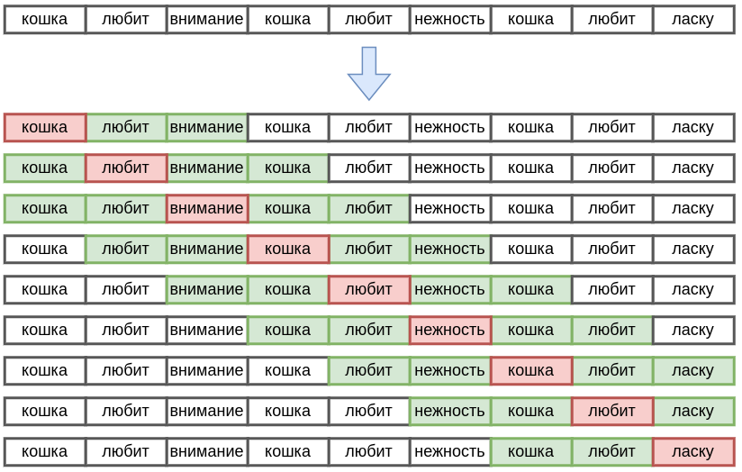
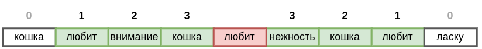

# Методы, основанные на совстречамости слов

## Матрица совстречаемости

Используя [дистрибутивную гипотезу](Word-embeddings#автоматическое-построение-эмбеддингов), можно кодировать каждое слово эмбеддингом по частотам других слов, с которыми оно часто встречается вместе. Для этого нужно сопоставить каждому слову отвечающую ему строку в **матрице совстречаемости слов** (co-occurence matrix) $M\in\mathbb{R}^{S\times S}$, где $S$ - число уникальных слов словаря.

Алгоритм расчёта элементов матрицы совстречаемости приведён ниже:

> Из последовательности слов исходного текста $w_1w_2…w_N$ извлекаем все <u>уникальные</u> слова $u_1,u_2,...u_S$ (формируем словарь).
> 
> Инициализируем матрицу совстречаемости $M\in\mathbb{R}^{S\times S}$ нулями.
> 
> Для каждой позиции в тексте $t=1,...N$:
> 
> - вычисляем контекст текущего слова $w_t$: 
>   
>   - $\text{context} = [w_{t-K},w_{t-K+1},...w_{t-1},w_{t+1},...w_{t+K-1},w_{K}]$
>   
>   - для каждого слова $u\in\text{context}$:
>     
>     - увеличиваем счётчик совстречаемости: $M[w_t, u]:=M[w_t, u]+1$

Если контекст выходит за пределы текста, то расчёт производится только по реально присутствующим словам в тексте. Например, для первого слова (при $t=1$) левого контекста ещё нет, и учитываются только правый контекст.

## Пример расчёта

Рассмотрим работу алгоритма на примере. Для текста "*Кошка любит внимание. Кошка любит нежность. Кошка любит ласку.*" уникальными словами будут [кошка, любит, внимание, нежность, ласку], а матрица совстречаемости для контекста $\pm 2$ слова будет строиться скользящим окном вокруг каждого слова, учитывая 2 соседних слова справа и слева, как показано на рисунке:

Каждая строка соответствует одной итерации алгоритма, на которой текущее слово помечено красным, а его контекст из $\pm 2$ слов - зелёным.

 В результате получим следующую матрицу совстречаемости:

|              | кошка | любит | внимание | нежность | ласку |
| ------------ | ----- | ----- | -------- | -------- | ----- |
| **кошка**    |       | 5     | 2        | 2        | 1     |
| **любит**    | 5     |       | 2        | 2        | 1     |
| **внимание** | 2     | 2     |          |          |       |
| **нежность** | 2     | 2     |          |          |       |
| **ласку**    | 1     | 1     |          |          |       |

> $i$-му слову будет соответствовать $S$-мерный эмбеддинг - $i$-ая строка матрицы совстречаемости.

Словам "внимание" и "нежность" соответствуют одинаковые эмбеддинги. Алгоритм, не вникая в смысл анализируемых слов, определил, что этим словам соответствует похожий смысл опосредованно, увидев, что кошка их одинаково любит!

## Учёт расстояния между словами

По умолчанию каждое слово, встретившееся в контексте, учитывается с одинаковым весом, поскольку каждое его попадание в контекст приводит к увеличению счётчика на единицу. Вместе с этим логично учитывать более близкие слова сильнее. Для этого можно задать вес связи, убывающий от расстояния между словами, и при встрече слов в контексте увеличивать счётчик совстречаемости не на единицу, а на этот вес [[1]](https://link.springer.com/content/pdf/10.3758/BF03204766.pdf). 

Например, для контекста $\pm 3$ слова вокруг слова "любит" соседние слова можно учитывать со следующими весами:

Элементы матрицы совстречаемости будут увеличиваться не на единичный вес, а на более высокий вес, если соответствующие им слова расположены ближе к текущему слову.

## Разделение левого и правого контекста

Можно строить эмбеддинг, разделяя совстречаемость слов справа и слева. Для этого матрица совстречаемости уже будет размера $M\in\mathbb{R}^{S\times 2S}$, поскольку при сканировании текста нужно будет отдельно накапливать счётчики встречаемости слов слева (L) и справа (R) от текущего слова. 

Для примера выше такая матрица совстречаемости будет

|          | кошка L | любит L | внимание L | нежность L | ласку  L | кошка R | любит R | внимание R | нежность R | ласку  R |
| -------- | ------- | ------- | ---------- | ---------- | -------- | ------- | ------- | ---------- | ---------- | -------- |
| кошка    |         | 2       | 1          | 1          |          |         | 3       | 1          | 1          | 1        |
| любит    | 3       |         | 1          | 1          |          | 2       |         | 1          | 1          | 1        |
| внимание | 1       | 1       |            |            |          | 1       | 1       |            |            |          |
| нежность | 1       | 1       |            |            |          | 1       | 1       |            |            |          |
| ласку    | 1       | 1       |            |            |          |         |         |            |            |          |

Анализируя только левые контексты, можно увидеть, что слова "внимание", "нежность" и "ласку" похожи по значению. В общем же случае слово представляется объединением его левого и правого контекста.

> В этом способе $i$-му слову будет соответствовать $i$-ая строка матрицы совстречаемости, а эмбеддинг будет уже $2S$-мерным.

## Снижение влияния частых слов

Слова в языке имеют сильно различающуюся частоту (см. закон Ципфа [[2]](https://ru.wikipedia.org/wiki/Закон_Ципфа)):

- союзы, предлоги, местоимения (такие как и, да, но, он, она,...) встречаются очень часто, такие слова называются **стоп-словами** (stop-words);

- прочие слова встречаются, напротив, достаточно редко.

Если извлекать эмбеддинги слов по счётчикам совстречаемости, то близость эмбеддингов будет доминироваться совместной встречаемостью стоп-словами, не несущими смысловой нагрузки.

Чтобы снизить влияние стоп-слов, элементы матрицы совстречаемости часто логарифмируют перед извлечением эмбеддингов:

$$
M_{ij} \to \log (M_{ij}+1)
$$

## Игнорирование случайных совместных встреч

Более качественные эмбеддинги извлекаются, если матрицу совстречаемости наполнять не счётчиками, сколько раз каждое слово встретилось в контексте, а значениями **положительной поточечной взаимной информации** (Positive Pointwise Mutual Information, PPMI), считаемой по формуле

$$
\text{PPMI}(w_i, w_j) = \max \left( \log \left( \frac{P(w_i, w_j)}{P(w_i) \cdot P(w_j)} \right), 0 \right),
$$

где 

- $P(w_i),P(w_j)$ - вероятности появления слов $w_i$​ и $w_j​$ в тексте,

- $P(w_i,w_j)$ - вероятность совместного появления слов $w_i$​ и $w_j​$.

Сила связи двух слов в PPMI определяется совстречаемостью не по абсолютным счётчикам, а относительно гипотезы, что <u>слова встречаются независимо друг от друга</u>. Это позволяет измерять силу связи между словами без искажений, во многом исключая влияние случайных совместных встреч. 

> Например, пары слов, удовлетворяющие условию ниже, вообще не будут влиять на эмбеддинги слов:
> 
> $$
> p(w_i|w_j)<p(w_j),
> $$
> 
> Это соответствует тому, что условная вероятность встречи слова меньше, чем безусловная, что свидетельствует в пользу того, что эпизодическая совстречаемость произошла <u>полностью случайно</u>.

## Влияние ширины контекста

Ширина контекста $K$ при построении матрицы совстречаемости оказывает значительное влияние на извлекаемые эмбеддинги слов.

**При более узком контексте** эмбеддинги будут отражать локальные и непосредственные отношения между словами. Это позволяет захватывать синтаксические и грамматические зависимости, такие как согласование, порядок слов, а также схожие структуры в близких контекстах. 

> Например, эмбеддинг слова «собака» в узком контексте может отражать такие соседние слова, как «бежит», «двор», «лает» и т. д. Это даёт представление о действиях и местах, связанных с «собакой».

**При более широком контексте** эмбеддинги будут более обобщёнными и связаны скорее с общим смыслом, включающем более широкие ассоциации. 

> В этом случае слово «собака» будет связано с такими словами, как «питомец», «животное», «уход», «забота», «друзья».

## Ограничения подхода

Поскольку число уникальных слов велико (имеет порядок нескольких сотен тысяч), эмбеддинги будут получаться высокоразмерными, что будет приводить к более медленной обработке текста и большему числу настраиваемых параметров модели.

Также элементы высокоразмерного эмбеддинга будут настраиваться неточно, поскольку они определяются <u>низкоуровневой</u> информацией о совместной встрече каждого слова с каждым, что сильно зависит от обучающей выборки.

В [следующей главе](Latent-semantic-analysis) мы рассмотрим, как можно сократить размерность полученных эмбеддингов, сделав их более <u>высокоуровневыми</u> (измеряющими похожесть по смыслу) и эффективными в использовании.

## Литература

1. [Lund K., Burgess C. Producing high-dimensional semantic spaces from lexical co-occurrence //Behavior research methods, instruments, & computers. – 1996. – Т. 28. – №. 2. – С. 203-208.](https://link.springer.com/content/pdf/10.3758/BF03204766.pdf)
2. [Wikipedia: Закон Ципфа.](https://ru.wikipedia.org/wiki/Закон_Ципфа)
