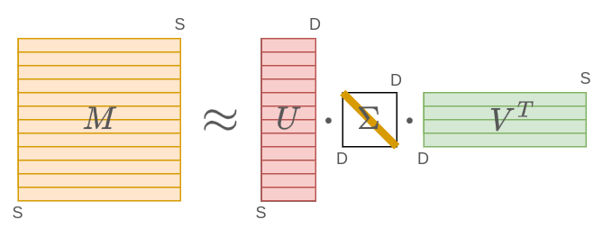

# Латентный семантический анализ

Методы, основанные на [совстречаемости слов](Count-based-methods), выдают эмбеддинги длины $S$ (число уникальных слов словаря). При раздельном учёте [левого и правого контекста](Count-based-methods#разделение-левого-и-правого-контекста) эмбеддинг будет размера $2S$. Поскольку число уникальных слов велико, то эмбеддинги будут получаться очень длинными, а работа с такими длинными эмбеддингами будет неэффективной, поскольку

- потребуется много вычислений,

- полученная перепараметризованная модель будет переобучаться.

Поэтому после получения высокоразмерного эмбеддинга его сжимают до значительно более низкой размерности $D\sim 300$.

## Усечённое сингулярное разложение

Для этого к матрице совстречаемости $M$ применяют **усечённое сингулярное разложение** (truncated singluar values decomposition, truncated SVD [[1]](https://ru.wikipedia.org/wiki/Сингулярное_разложение)), являющееся наиболее точным низкоранговым приближением исходной матрицы по норме Фробениуса [[2]](https://ru.wikipedia.org/wiki/Норма_матрицы):

$$
M \approx U\cdot \Sigma \cdot V^T, \quad U^T\cdot U = I, \; V^T\cdot V = I, \Sigma=\text{diag}\{\sigma_1, \sigma_2, ...\sigma_D\},
$$

где $I$ обозначает единичную матрицу размера $D\times D$, а $\text{diag}\{\sigma_1,\sigma_2,...\sigma_D\}$ - диагональную с элементами $\sigma_1\ge \sigma_2\ge...\ge\sigma_D\ge0$, называемыми **сингулярными числами** (singluar values). 

Размеры соответствующих матриц: $U,V\in\mathbb{R}^{S\times D},\Sigma\in\mathbb{R}^{D\times D}$, а $D$ является выбираемым гиперпараметром.

> Чем $D$ выше, тем приближение матрицы будет менее экономичным, зато более точным. Безошибочная точность достигается, когда $D$ больше либо равна  ранга матрицы $M$.

Графически сингулярное разложение можно представить следующим образом (рядом с каждой матрицей указан её размер):

## Интуиция сингулярного разложения

В [методах совстречаемости](Count-based-methods) $i$-му слову соответствует $i$-й полноразмерный эмбеддинг в виде $i$-й строки матрицы $M$. Из сингулярного разложения следует, что все эмбеддинги представляются линейной комбинацией строк матрицы $V^T$. Можно показать, что это первые $D$ главных компонент [[3]](https://ru.wikipedia.org/wiki/Метод_главных_компонент) для эмбеддингов всех слов. Интуитивно эти строки показывают **основные темы** или **высокоуровневые смысловые концепции**, линейно комбинируя которые, можно получить эмбеддинг любого слова с высокой точностью. 

> Например, при анализе новостей такими концепциями могут быть темы политики, экономики, спорта, культуры и т.д.

$i$-й элемент матрицы $\Sigma$ будет весом, на который домножается каждая тема. По смыслу этот коэффициент показывает важность темы для восстановления [полноразмерных эмбеддингов](Count-based-methods) (состоящих из всех слов).

А $i$-ая строка матрицы $U$ будет обозначать коэффициенты, с которыми каждую из тем нужно сложить/вычесть, чтобы (приближённо) получить исходный [полноразмерный эмбеддинг](Count-based-methods).

## Построение низкоразмерных эмбеддингов

Чтобы эффективно представить $i$-ое слово, достаточно перейти от его полноразмерного эмбеддинга к сокращённому - $i$-й строке матрицы $U$. 

По сути при этом мы перейдём от описания слова по контекстным словам, с которыми оно часто встречается, к его описанию в терминах семантически высокоуровневых тем, к которым оно принадлежит. Такой подход называется **латентным семантическим анализом** (Latent Semantic Analysis, LSA).

:::tip Классический LSA

Более часто подход LSA используется не для построения **эмбеддингов слов**, а для построения **эмбеддингов документов**: 

1. Каждый документ представляется $S$-мерным эмбеддингом по тому, насколько часто в нём встречается каждое слово языка (в виде счётчиков встречаемости, частоты встречаемости либо TF-IDF [[4]](https://ru.wikipedia.org/wiki/TF-IDF) представления).

2. Эти эмбеддинги конкатенируются в матрицу $M\in\mathbb{R}^{N\times S}$, где $N$ - число документов.

3. Далее точно так же к матрице $M$ применяется метод LSA, в результате которого каждый документ кодируется уже сокращенным $D$-мерным эмбеддингом, представляющим собой степени представленности каждой темы уже не в слове, а <u>в документе</u> среди тем, заданных строками матрицы $V^T$.

:::

---

Пока мы изучили построение эмбеддингов слов методами классического машинного обучения. Далее мы изучим нейросетевой подход [Word2vec](Word2vec) для построения эмбеддингов слов, а также нейросетевой метод для построения [эмбеддингов целых параграфов в тексте](Paragraph-embeddings).

## Литература

1. [Wikipedia: Сингулярное разложение.](https://ru.wikipedia.org/wiki/Сингулярное_разложение)
2. [Wikipedia: Норма матрицы.](https://ru.wikipedia.org/wiki/Норма_матрицы)
3. [Wikipedia: Метод главных компонент.](https://ru.wikipedia.org/wiki/Метод_главных_компонент)
4. [Wikipedia: TF-IDF.](https://ru.wikipedia.org/wiki/TF-IDF)
