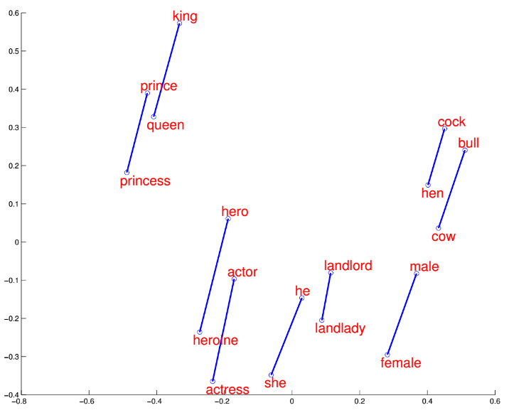
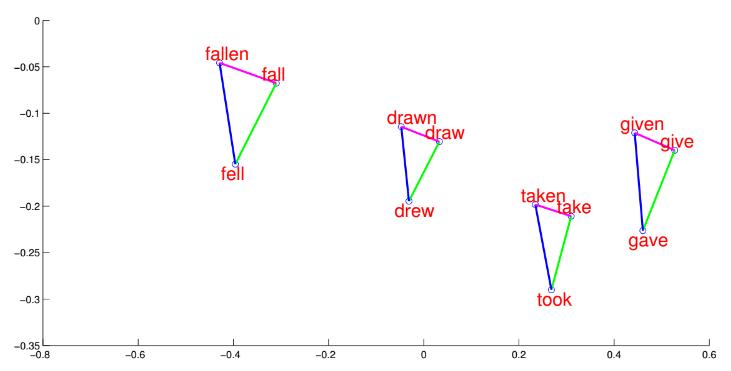

# Word2vec

Методы построения эмбеддингов слов, описанные ранее, основаны на вычислении [счётчиков совстречаемости слов](Count-based-methods) и применения к ним [сингулярного разложения](Latent-semantic-analysis). 

Одним из первых очень популярных нейросетевых методов построения эмбеддингов является **Word2vec** [[1]](https://www.khoury.northeastern.edu/home/vip/teach/DMcourse/4_TF_supervised/notes_slides/1301.3781.pdf), [[2]](https://proceedings.neurips.cc/paper/2013/hash/9aa42b31882ec039965f3c4923ce901b-Abstract.html), представляющий собой две модели: **Skip-Gram** и **CBOW**.

Обе модели анализируют текст, составленный из большого количества документов, объединённых в одну длинную последовательность слов. 

> В классической реализации документы просто объединялись, но если необходимо явно обозначить границы между документами, то каждый документ перед объединением можно дополнить токеном START $K$ раз в начале и токеном STOP $K$ раз в конце, где $K$ - гиперпараметр, определяющий ширину контекста.

После объединения все документы представляют собой последовательность слов

$$
w_1w_2w_3,....w_T,
$$

состоящую из $S$ уникальных слов (возможно, дополненных спец. токенами START и STOP).

**Skip-Gram** и **CBOW** представляют собой **языковые модели** (language models), то есть модели, предсказывающие часть текста по другой части текста. В них текст сканируется скользящим окном из $\pm K$ соседних слов с центром в слове $w_t$, $t=1,2,\dots T$, как показано для примера ниже:

Каждое слово $w$ этих моделей может выступать в двух ролях:

- <u>когда слово известно</u>, и по нему нужно предсказывать другое слово;

- <u>когда слово предсказывается</u> по соседним словам.

Поэтому каждому слову $w$ ставится в соответствие два настраиваемых эмбеддинга:

- $\mathbf{u}_w \in \mathbb{R}^D$ - **входной эмбеддинг** (когда слово известно);

- $\mathbf{v}_w\in\mathbb{R}^D$ - **выходной эмбеддинг** (когда слово предсказывается по соседям).

> Размерность эмбеддингов $D$ берётся равной примерно 300.

В моделях настраиваются параметры $\theta$, представляющие собой все входные и выходные эмбеддинги для каждого слова:

$$
\theta = \{\mathbf{u}_w, \mathbf{v}_w\}_w
$$

Конечной целью настройки языковых моделей является не прогнозирование слов само по себе, а <u>настроенные эмбеддинги слов</u>, которые затем используются в других задачах анализа текста, используя [трансферное обучение](../Regularization/Transfer-learning). 

## Skip-Gram

В методе **Skip-Gram** модель по известному центральному слову окна (контексту) учится предсказывать соседние слова в этом окне для каждого положения скользящего окна:

$$
\frac{1}{T}\sum_{t=1}^{T}\sum_{-K\le i\le K,\,i\ne0}\ln p(w_{t+i}|w_{t})\to\max_{\theta}
$$

Слово $w_{t+i}$ считается более сочетаемым с контекстным словом $w_{t}$, если скалярное произведение их эмбеддингов $u_{w_{t}}^{T} v_{w_{t+i}}$ выше, поэтому вероятность появления слова в контексте другого считается через [SoftMax-преобразование](../MLP/Outputs-loss-functions#softmax-преобразование) от скалярных произведений:

$$
p(w_{t+i}|w_{t})=\frac{\exp\left(\mathbf{u}_{w_{t}}^{T}\mathbf{v}_{w_{t+i}}\right)}{\sum_{w'=1}^{S}\exp\left(\mathbf{u}_{w_{t}}^{T}\mathbf{v}_{w'}\right)}
$$

Результатом настройки Skip-Gram являются <u>входные эмбеддинги</u> каждого слова $\{\mathbf{u}_w\}_w$. Можно было бы использовать и выходные эмбеддинги, но, как будет ясно из [методов ускоренной настройки Skip-Gram](Skip-Gram-optimization), они играют вспомогательную, а не основную роль.

## CBOW

В методе **CBOW** модель по соседним словам окна учится предсказывать центральное слово:

$$
\frac{1}{T}\sum_{t=1}^{T}\ln p(w_{t}|w_{t-K},..w_{t-1},w_{t+1},...w_{t+K})\to\max_{\theta}
$$

Здесь $T$ - общая длина текста, а $\theta$ - настраиваемые параметры.

> Таким образом, в CBOW известным контекстом выступают соседние слова вокруг слова $w_t$.

Информация о соседних словах представляется в виде контекстного эмбеддинга, вычисляемого как сумма входных эмбеддингов этих слов:

$$
\mathbf{u}_{c}=\sum_{-K\le i\le K,\,i\ne0}\mathbf{u}_{w_{t+i}}
$$

Слово $w$ считается более сочетаемым с контекстом, если скалярное произведение его эмбеддинга с эмбеддингом контекста $\mathbf{v}_w^T \mathbf{u}_c$ выше, поэтому вероятность предсказываемого центрального слова считается через [SoftMax-преобразование](../MLP/Outputs-loss-functions#softmax-преобразование) от скалярных произведений:

$$
p(w_{t}|w_{t-c},..w_{t-1},w_{t+1},...w_{t+c})=\frac{\exp\left(\mathbf{u}_{c}^{T} \mathbf{v}_{w_{t}}\right)}{\sum_{w'=1}^{S}\exp\left(\mathbf{u}_{c}^{T}\mathbf{v}_{w'}\right)}
$$

Результатом настройки CBOW являются <u>выходные эмбеддинги</u> каждого слова $\{\mathbf{v}_w\}_w$, несущие семантическую информацию о каждом отдельном слове. Входные эмбеддинги же менее информативны, поскольку используются не сами по себе, а в контексте других соседних слов.

## Регулярности в эмбеддингах

Простота моделей Skip-Gram и CBOW позволила их обучить на гигантских коллекциях текстов из интернета и получить эмбеддинги, качественно отражающие смысл (семантику) этих слов.

Например, на сайте http://epsilon-it.utu.fi/wv_demo/ можно задать слово и получить наиболее похожие на него другие слова в пространстве эмбеддингов Word2Vec при сравнении по [косинусной мере близости](../../Machine-learning/Metric-methods/Distance-functions#косинусная-мера-близости). Можно убедиться, что близким словам действительно соответствуют слова близкие по смыслу, например: 

| слово   | близкие слова                        |
| ------- | ------------------------------------ |
| student | teacher, faculty, school, university |
| car     | truck, jeep, vehicle                 |
| country | nation, continent, region            |

Примечательно, что связь между эмбеддингами слов оказалась приближённо линейной, например:

- $v_{\text{king}}-v_{\text{queen}} \approx v_{\text{man}}-v_{\text{woman}};$

- $v_{\text{Paris}}-v_{\text{France}} \approx v_{\text{Rome}}-v_{\text{Italy}};$

- $v_{\text{apple}}-v_{\text{apples}} \approx v_{\text{car}}-v_{\text{cars}};$

- $v_{\text{doctor}}-v_{\text{hospital}} \approx v_{\text{teacher}}-v_{\text{school}}.$

При отображении эмбеддингов слов в двумерном пространстве с помощью **метода главных компонент** эти линейные связи также хорошо видны [[3]](https://ysu1989.github.io/courses/sp20/cse5243/Word-Embedding1.pdf):

## FastText

Эмбеддинги, настроенные методом Word2Vec, будут известны только для тех слов, которые <u>хотя бы раз встретились в обучающей текстовой коллекции</u>. При этом на практике в языке постоянно появляются новые слова, а известные слова часто пишутся с опечатками (например, в поисковой системе). Чтобы строить эмбеддинги для новых слов и слов с опечатками, в методе FastText [[4]](https://arxiv.org/pdf/1607.04606) предложено представлять каждое слово в виде эмбеддинга не само по себе, а как сумму его [n-грамм](https://ru.wikipedia.org/wiki/N-%D0%B3%D1%80%D0%B0%D0%BC%D0%BC%D0%B0), то есть групп из $n$ подряд идущих символов, которые встретились в слове.

При этом для того, чтобы обозначить начало и конец слова, слово дополняется спец. символами: 

- [ - начало слова;

- ] - конец слова.

> Например, при построении 3-грамм слова "person", оно вначале будет представлено как "[person]", а затем из него уже будут извлечены соответствующие 3-граммы: "[pe","per","ers","rso","son","on]".

<u>Входной эмбеддинг</u> слова $\mathbf{u}_w$ заменяется на сумму эмбеддингов составляющих это слово n-грамм:

$$
\mathbf{u}_w\to \sum_{\mathbf{e}\in\text{n-grams}(w)} \mathbf{e}_{j}
$$

> В fastText рассматривались n-граммы с $3\le n \le 6$, а также в число n-грамм включалось всё слово целиком.

При предсказываемое слово задаётся единственным эмбеддингом всего слова, как в модели SkipGram.

При применении fastText, если модель увидит новое слово или старое, но записанное с опечаткой, она всё равно сможет сопоставить ему эмбеддинг <u>как сумму входных эмбеддингов от составляющих это слово n-грамм</u>, которые уже встречались в других словах.

> Настройка FastText вычислительно сложнее настройки SkipGram, поскольку нужно настраивать не только эмбеддинги слов, но и эмбеддинги составляющих их n-gram. В целях оптимизации памяти в статье предлагалось отображать в эмбеддинги не каждую n-грамму, а каждое хэш-значение n-граммы. Для этого все n-граммы отображались в редуцированный набор значений, используя хэш-функцию. А эмбеддинги строились не для всех n-грамм, а только для всех выходных значений хэш-функции.

FastText настраивается точнее SkipGram за счёт <u>более точного учёта морфологии слов</u>, поскольку даже если само слово встречается в обучающем тексте редко, то составляющие его n-граммы встречаются гораздо чаще. 

> Например, модель SkipGram обрабатывает слова run, running, runned, runner как независимые слова. Их общность воссоздаётся лишь за счёт похожих контекстов. Модель FastText же сразу увидит схожесть этих слов за счёт общего корня run.

## Литература

1. [Mikolov T. Efficient estimation of word representations in vector space //arXiv preprint arXiv:1301.3781. – 2013. – Т. 3781.](https://www.khoury.northeastern.edu/home/vip/teach/DMcourse/4_TF_supervised/notes_slides/1301.3781.pdf)
2. [Mikolov T. et al. Distributed representations of words and phrases and their compositionality //Advances in neural information processing systems. – 2013. – Т. 26.](https://proceedings.neurips.cc/paper/2013/hash/9aa42b31882ec039965f3c4923ce901b-Abstract.html)
3. [Yu Su lectures: word embeddings.](https://ysu1989.github.io/courses/sp20/cse5243/Word-Embedding1.pdf)
4. [Bojanowski P. et al. Enriching word vectors with subword information //Transactions of the association for computational linguistics. – 2017. – Т. 5. – С. 135-146.](https://arxiv.org/pdf/1607.04606)
