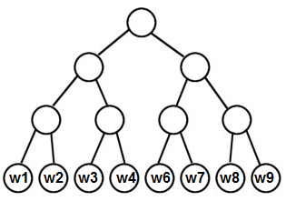

# Оптимизация Skip-Gram

Для качественной настройки [эмбеддингов слов](Word-embeddings) в модели [Skip-Gram](Word2vec#skip-gram) её нужно настраивать на гигантских коллекциях текстовых данных (100 миллионов слов и больше). Это связано с вычислительными трудностями, поскольку при расчёте вероятностей каждого слова приходится вычислять знаменатель следующей дроби:

$$
p(w_{t+i}|w_{t})=\frac{\exp\left(\mathbf{u}_{w_{t}}^{T} \mathbf{v}_{w_{t+i}}\right)}{{\color{red}\sum_{w=1}^{S}\exp\left(\mathbf{u}_{w_{t}}^{T} \mathbf{v}_{w}\right)}},
$$

равный *сумме величин для всех уникальных слов языка $S$*, а их очень много!

Поэтому для ускорения настройки Skip-Gram используются специальные вычислительно эффективные методы - **иерархический SoftMax** либо **негативное сэмплирование** [[1]](https://proceedings.neurips.cc/paper/2013/hash/9aa42b31882ec039965f3c4923ce901b-Abstract.html).

:::tip CBOW

В модели CBOW присутствует такая же проблема, и для её оптимизации используются свои усовершенствованные методики оптимизации. Здесь они не рассматриваются, так как на практике в основном используется Skip-Gram как более эффективное решение, поскольку в нём известный контекст вычисляется <u>по одному слову</u>, а не по совокупности.

:::

## Иерархический SoftMax

В методе **Hierarchical SoftMax** [[1]](https://proceedings.neurips.cc/paper/2013/hash/9aa42b31882ec039965f3c4923ce901b-Abstract.html) строится бинарное дерево, каждому листу которого ставится в соответствие уникальное слово языка. Таким образом, в дереве будет $S$ листов, а если его строить сбалансированным (так, что расстояние до каждого листа одно и то же), то его глубина будет $\left\lceil\log_2 S\right\rceil$.

Ниже приведён пример такого дерева:

Вместо выходных эмбеддингов <u>каждого слова</u> $\{\mathbf{v}_w\}_w$ вычисляются выходные эмбеддинги $\{\mathbf{v}_j\}_j$ для <u>каждого внутреннего узла</u> $j$ бинарного дерева.

Пусть нам нужно посчитать вероятность $p(w_O|w_I)$. Эту вероятность можно посчитать не за $O(S)$, а за $O(\log S)$, осуществляя спуск по бинарному дереву от корня до предсказываемого слова $w_O$. 

Вероятности из каждого узла $j$ перейти в левого и правого потомка задаются по правилам:

$$
\begin{aligned}
p(\text{left}|j)   &=  \sigma\left(\mathbf{v}_{j}^{T} \mathbf{u}_{w_I}\right),\\
p(\text{right}|j)  &=  1-\sigma\left(\mathbf{v}_{j}^{T} \mathbf{u}_{w_I}\right)=\sigma\left(-\mathbf{v}_{j}^{T} \mathbf{u}_{w_I}\right),
\end{aligned}
$$

где $\sigma(\cdot)$ - [сигмоидная функция](../MLP/Activation-functions#сигмоидная-функция-активации-sigmoid), а целевая вероятность $p(w_O|w_I)$ считается как произведение этих вероятностей при спуске от корня до слова $w_O$.

После настройки Skip-Gram этим методом в конечном итоге используются <u>входные эмбеддинги слов</u> $\{\mathbf{u}_w\}_w$, поскольку выходные эмбеддинги соответствуют не словам, а узлам дерева.

:::tip Дополнительное ускорение

Метод Hierarchical SoftMax можно дополнительно ускорить, строя не сбалансированное дерево, а несбалансированное дерево Хаффмана [[2]](https://en.wikipedia.org/wiki/Huffman_coding), которое <u>более частым словам будет назначать более короткие пути на дереве</u> от корня до соответствующего листа. В результате спуск по дереву для самых частых слов (таких, как стоп-слова) будет максимально коротким и быстрым!

:::

## Негативное сэмплирование

Метод **негативного сэмплирования** (negative sampling [[1]](https://proceedings.neurips.cc/paper/2013/hash/9aa42b31882ec039965f3c4923ce901b-Abstract.html)) представляет собой альтернативный подход к настройке Skip-Gram модели. В нём для известного слова $w_t$ и предсказываемого $w_{t+i}$ максимизируется не логарифм вероятности $p(w_{t+i}|w_t)$, а другая суррогатная, зато быстро вычислимая функция.

Как и раньше, мы сканируем текст скользящим окном. Для каждого положения окна и известного слова $w_t$ в его центре, а также для предсказываемого соседнего слова $w_{t+i}$ сэмплируется $D$ <u>случайных</u> слов $w_{j(1)},w_{j(2)},...w_{j(D)}$, после чего производится одна итерация оптимизационного алгоритма, максимизирующего следующий критерий:

$$
\ln\underset{\sigma\left(\mathbin{\color{red}+}\mathbf{u}_{w_{t}}^{T}\mathbf{v}_{w_{t+i}}\right)}{\underbrace{\left(\frac{1}{1+e^{\mathbin{\color{red}-}\mathbf{u}_{w_{t}}^{T} \mathbf{v}_{w_{t+i}}}}\right)}}+\sum_{k=1}^{K}\ln\underset{\sigma\left(\mathbin{\color{red}-}\mathbf{u}_{w_{t}}^{T} \mathbf{v}_{w_{t+i}}\right)}{\underbrace{\left(\frac{1}{1+e^{\mathbin{\color{red}+} \mathbf{u}_{w_{t}}^{T} \mathbf{v}_{w_{t+i}}}}\right)}}\to\text{max}_{\mathbf{u}_{w_{t}}, \mathbf{v}_{w_{t+i}}}
$$

> Гиперпараметр $K$ берётся из диапазона 2-10.

Первое слагаемое сближает эмбеддинги слов, которые являются соседями, а второе - раздвигает эмбеддинги выбранного слова и случайных слов, которые (в общем случае) не попали в его контекст.

> Случайные слова можно сэмплировать из априорного распределения:
> 
> $$
> w\sim p(w),
> $$
> 
> то есть из вероятности встречи каждого слова в тексте самого по себе. Однако поскольку распределение слов сильно неравномерное (например, стоп-слова встречаются гораздо чаще остальных), то при таком методе методе сэмплирования будут в основном использоваться только часто встречаемые слова (такие, как стоп-слова)!
> 
> Для того, чтобы сэмплирование слов оказывалось более разнообразным,  слова сэмплируются из распределения $p\left(w_{j(k)}\right)\propto p(w)^{3/4}$. 

Метод негативного сэмплирования является более распространённым, чем иерархический SoftMax, поскольку одна его итерация работает за $O(K)$, а не за $O(\log S)$, а $K$ можно выбрать небольшим ($K\sim 2-10$). При этом оба метода обеспечивают примерно одинаковое качество итоговых эмбеддингов.

## Литература

1. [Mikolov T. et al. Distributed representations of words and phrases and their compositionality //Advances in neural information processing systems. – 2013. – Т. 26.](https://proceedings.neurips.cc/paper/2013/hash/9aa42b31882ec039965f3c4923ce901b-Abstract.html)
2. [Wikipedia: Huffman coding.](https://en.wikipedia.org/wiki/Huffman_coding)

