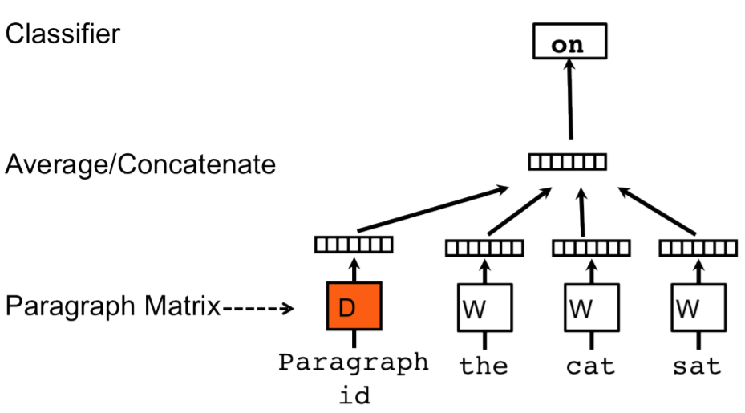
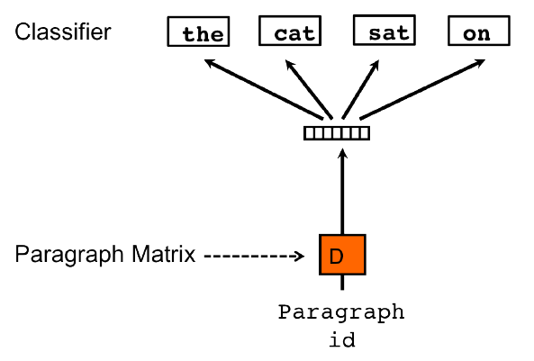

# Эмбеддинги параграфов

Ранее мы рассматривали методы построения [эмбеддингов слов](Word-embeddings). Однако c помощью эмбеддингов можно представлять не только отдельные слова, но и <u>целые фрагменты текста, такие как предложения, параграфы или даже документы</u>. Это позволяет обрабатывать фрагменты нейросетями и другими моделями машинного обучения целиком, учитывая их совокупную семантику как целого (а не по смыслу отдельных слов, которые могут идти в разном порядке, меняя смысл фрагмента).

> Вспомним классическое: 
> 
> - "казнить, нельзя помиловать"
> 
> - "казнить нельзя, помиловать".

Для определённости будем рассматривать случай параграфов, хотя те же методы применимы, когда мы делим текст на предложения, главы и документы. Задача состоит в том, чтобы каждому известному параграфу обучающей выборки $p$ сопоставить его эмбеддинг $\mathbf{e}_p\in\mathbb{R}^D$.

> Полученные эмбеддинги можно потом использовать для классификации параграфов (определение темы параграфа), нахождения параграфов, являющихся переформулировками друг друга, создания поисковой системы по параграфам и т.д.

В работе [[1]](https://proceedings.mlr.press/v32/le14.html?ref=https://githubhelp.com) предложено кодировать параграфы эмбеддингами двумя методами: **PV-DM** и **PV-DBOW**. 

# PV-DM

Метод **PV-DM** (Distributed Memory Model of Paragraph Vectors [[1]](https://proceedings.mlr.press/v32/le14.html?ref=https://githubhelp.com)) оценивается точно так же, как метод [CBOW](Word2vec#cbow) для слов, но центральное слово скользящего окна предсказывается по среднему от эмбеддингов окружающих его слов <u>и эмбеддингу параграфа</u> $\mathbf{e}_p$, в котором это слово находится. 

Для этого можно:

- строить эмбеддинг известного контекста, усредняя не только по эмбеддингам соседних слов, но и по эмбеддингу параграфа;

- конкатенировать эмбеддинг параграфа к эмбеддингу, построенному как среднее соседних известных слов контекста.

Графически это можно представить в следующем виде [[1]](https://proceedings.mlr.press/v32/le14.html?ref=https://githubhelp.com):

## PV-DBOW

Метод **PV-DBOW** (Distributed Bag of Words version of Paragraph Vector [[1]](https://proceedings.mlr.press/v32/le14.html?ref=https://githubhelp.com)) работает точно так же, как [Skip-Gram](Word2vec#skip-gram) для слов: обучающий текст обрабатывается скользящим окном, но на этот раз

- предсказываются <u>все слова окна</u> (то есть и центральное слово окна тоже);

- контекстом выступает не центральное слово, а <u>параграф, содержащий слова окна</u>.

Графически это визуализировано ниже [[1]](https://proceedings.mlr.press/v32/le14.html?ref=https://githubhelp.com):

:::warning Ограничения метода

Обратим внимание, что для построения эмбеддингов параграфа этот параграф <u>должен быть известен заранее</u> в обучающем тексте. Модель будет полезна, когда мы хотим создать поисковую систему по документам электронной библиотеки из заранее известных документов. Но мы не сможем её применить для поиска по новым документам.

Для генерации эмбеддингов для новых текстов нужно либо дообучать под них уже настроенную модель, либо использовать другие методы построения эмбеддингов, например, используя [рекуррентные нейросети](../Recurrent-neural-nets/RNN).

:::

## Литература

1. [Le Q., Mikolov T. Distributed representations of sentences and documents //International conference on machine learning. – PMLR, 2014. – С. 1188-1196.](https://proceedings.mlr.press/v32/le14.html?ref=https://githubhelp.com)
