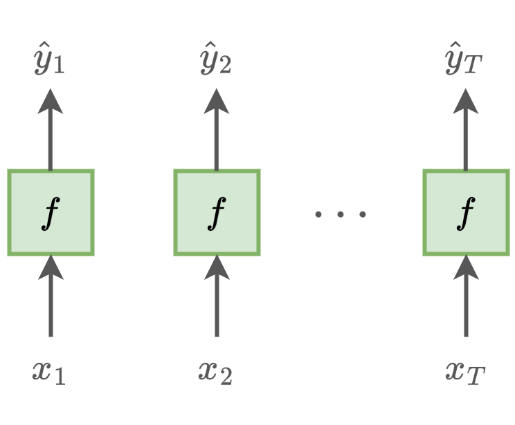
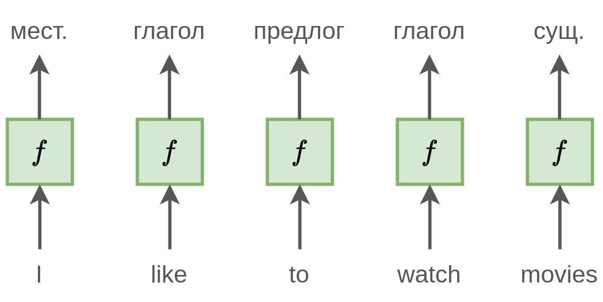
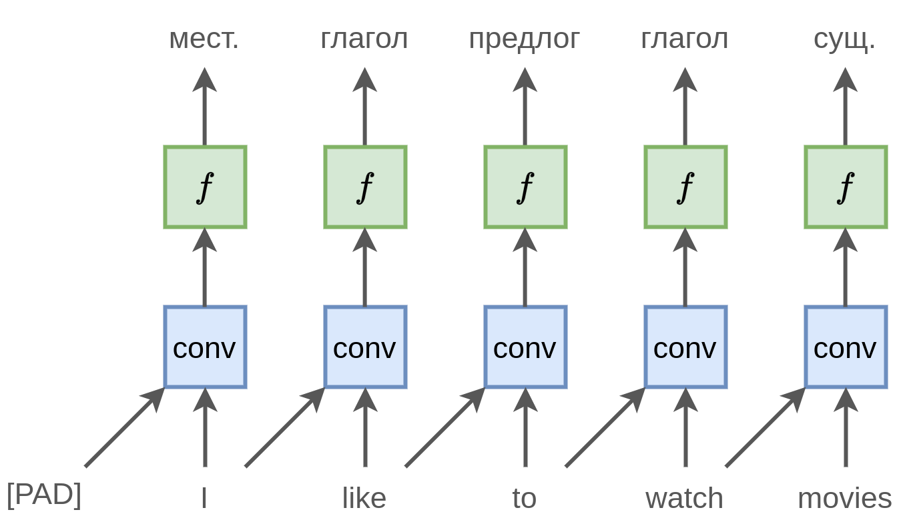
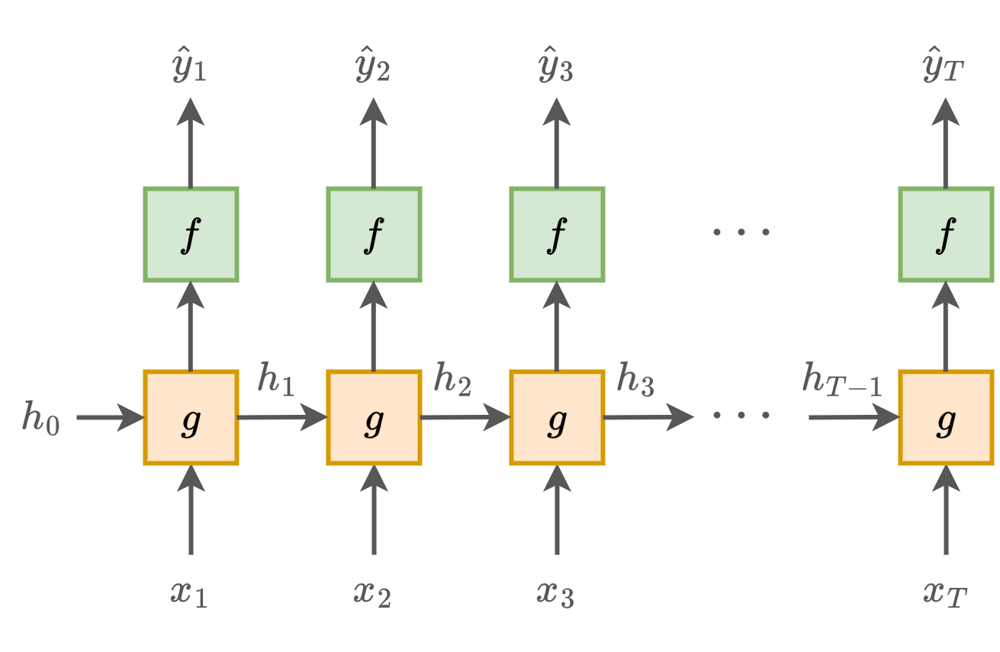
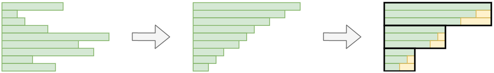
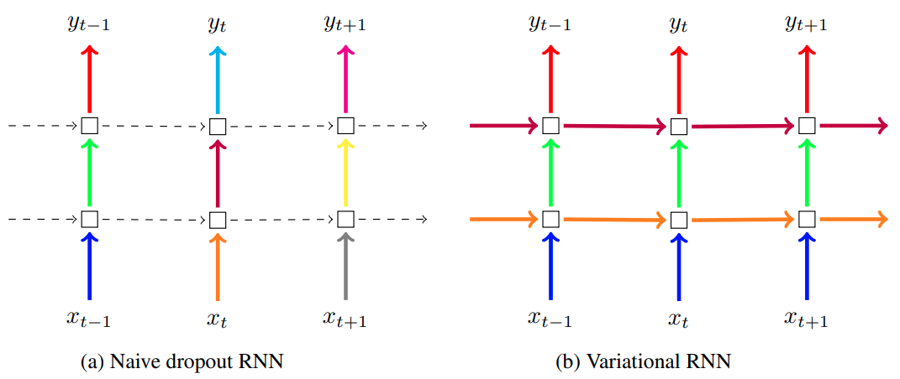

# Рекуррентная сеть

## Обработка последовательностей

Входные данные часто представляются в виде <u>последовательности</u> $\mathbf{x}_1\mathbf{x}_2...\mathbf{x}_T$, например:

- динамика цен на акции,

- динамика действий посетителя веб-сайта,

- изменение погоды,

- текст как последовательность слов,

- речь как последовательность звуков,

- видео как последовательность кадров.

> Далее для определённости будем рассматривать текст как последовательность слов, подаваемых на вход нейросети в виде [эмбеддингов](../Embeddings/Word-embeddings), хотя те же рассуждения применимы и для обработки последовательностей других типов.

## Независимая обработка

Мы могли бы обрабатывать каждый элемент последовательности $\mathbf{x}$ независимо, используя [многослойный персептрон](../MLP/Multilayer-perceptron) $f(\mathbf{x})$:

Но такой подход <u>не учитывает зависимости выхода от других элементов последовательности</u>. Например, будущие действия посетителя веб-сайта зависят от его старых действий, динамика будущих цен зависит от их исторических изменений, новые слова текста зависят от старых и т.д.

Проиллюстрируем это примером. Пусть решается задача разметки частей речи для текста (part-of-speech tagging, POS), в которой каждому слову нужно автоматически сопоставить часть речи. Пусть мы обрабатываем фразу "I like to watch movies":

При независимой обработке слов модель будет часто ошибаться, поскольку <u>не учитывает контекст соседних слов</u>, влияющих на роль каждого слова в предложении.

- [watch] может быть как глаголом, так и существительным, например, во фразе "*this is a very expensive watch*".

- [like] также может выступать как существительное, например, во фразе "*he gave this post a like*".

Если бы модель учитывала предыдущие слова (перед [like] стоит [I], перед [watch] стоит [to]), подобной неоднозначности для неё бы не возникало.

## Использование свёрток

Мы могли бы применить операцию свёртки, чтобы учесть левый контекст:

Но тогда был бы учтён контекст, состоящий лишь из одного левого соседа. Часто важен более длинный контекст, например для разрешения неоднозначности слова [watch] во фразе "*I like to walk and watch movies*". 

Для учёта контекста из $K$ соседей можно было бы применить свёртку с более широким ядром или $K$ раз применить свёртку с двумерным ядром. Ранее мы уже рассматривали эту идею в [свёрточных сетях для обработки последовательностей](../ConvPool-1D/Convolutional-nets-for-sequences). Недостатком архитектуры является то, что использование свёрток приводит к обработке, учитывающей лишь <u>ограниченный</u> контекст.

## Рекуррентные сети

Учитывая перечисленные недостатки, для анализа и обработки последовательностей чаще используются **рекуррентные нейросети** (Recurrent neural net, RNN), способные помнить (в теории) <u>весь исторический контекст</u> из предыдущих наблюдений и учитывать его <u>вычислительно эффективно</u>.

Для этого используется **скрытое состояние** (hidden state) $\mathbf{h}_t\in\mathbb{R}^{D_h}$, хранящее контекст из <u>всех ранее виденных наблюдений</u>. Прогноз строится, учитывая не только текущее наблюдение $\mathbf{x}_t$, но и $\mathbf{h}_t$, что обеспечивает зависимость прогноза от всей истории наблюдений:

$$
\hat{\mathbf{y}}_t = f(\mathbf{x}_t, \mathbf{h}_t)
$$

> $\hat{y}_t$ часто не является итоговым прогнозом, а представляет собой лишь промежуточный эмбеддинг, к которому уже применяется [многослойный персептрон](../MLP/Multilayer-perceptron) для получения итогового прогноза.

Само скрытое состояние пересчитывается на каждом шаге обработки последовательности рекуррентно по текущему наблюдению и своему значению на предыдущем шаге обработки:

$$
\mathbf{h}_t=g(\mathbf{x}_t, \mathbf{h}_{t-1}), \quad t=1,2,3,...
$$

Последовательный процесс генерации прогнозов $\hat{\mathbf{y}}_1,\hat{\mathbf{y}}_2,...\hat{\mathbf{y}}_T$ по входам $\mathbf{x}_1,\mathbf{x}_2,...\mathbf{x}_T$ 

и скрытым состояниям можно графически представить так:

При этом $\mathbf{h}_0\in\mathbb{R}^{D_h}$ - тоже параметр сети, который можно задавать вектором из нулей или настраивать по данным.

Если **разворачивать зависимость рекуррентной сети** (network unfolding)

$$
\widehat{\mathbf{y}}_{t}=f(\mathbf{h}_{t})=f(g(\mathbf{x}_{t},\mathbf{h}_{t-1}))=f(g(\mathbf{x}_{t},g(\mathbf{x}_{t-1},\mathbf{h}_{t-2})))=\\=f(g(\mathbf{x}_{t},g(\mathbf{x}_{t-1},g(\mathbf{x}_{t-2},\mathbf{h}_{t-3}))))=...=F(\mathbf{x}_{t},\mathbf{x}_{t-1},...\mathbf{x}_{1},\mathbf{h}_{0}),
$$

то можно увидеть, что $\hat{\mathbf{y}}_t$ зависит от всех ранее виденных наблюдений $\mathbf{x}_{t},\mathbf{x}_{t-1},...\mathbf{x}_{1}$ и строится многократным применением одних и тех же преобразований $g(\cdot),f(\cdot)$, просто применённых к различным входным данным. 

Таким образом, рекуррентная сеть - это обычная многослойная сеть, имеющая на каждом слое <u>одинаковые параметры</u> (weight sharing), а число слоёв пропорционально номеру обрабатываемого элемента последовательности $t$. То есть для длинного входа эта сеть может содержать <u>очень большое число слоёв</u>.

## Проблемы настройки

Из-за того, что число слоёв велико, а параметры сети одни и те же на каждом слое, настройка рекуррентной сети довольно неустойчива и имеет тенденцию скатываться в одну из крайностей:

- сеть экспоненциально быстро забывает историю (**проблема затухающих градиентов**, vanishing gradient problem);

- сеть экспоненциально быстро увеличивает вклад дальних наблюдений в прогноз, вследствие чего прогноз и настройка весов ведут себя неустойчиво (**проблема взрывающихся градиентов**, exploding gradient problem).

Для решения первой проблемы используются специальные архитектуры, такие как [GRU и LSTM](LSTM-GRU).

Для решения второй используется [обрезка градиентов](../Training-simplification/Gradient-clipping) (gradient clipping) по абсолютному или относительному значению. 

## Простейшая рекуррентная сеть

Простейшей рекуррентной сетью является **сеть Элмана** [[1]](https://onlinelibrary.wiley.com/doi/abs/10.1207/s15516709cog1402_1):

$$
\begin{aligned}
\mathbf{h}_{t} & =g\left(W_{xh}\mathbf{x}_{t}+W_{hh}\mathbf{h}_{t-1}+\mathbf{b}_{h}\right),\\
\widehat{\mathbf{y}}_{t} & =f\left(W_{hy}\mathbf{h}_{t}+\mathbf{b}_{y}\right),
\end{aligned}

$$

где

- $g(\cdot),f(\cdot)$ - некоторые функции нелинейности;

- $W_{xh},W_{hh},W_{hy}$ - обучаемые матрицы;

- $\mathbf{b}_h,\mathbf{b}_y$ - обучаемые вектора смещений.

## Настройка рекуррентной сети

Для эффективного использования возможностей параллелизации на видеокарте, рекуррентная сеть синхронно обрабатывает не одну последовательность, а сразу [минибатч](../Training/Opt-methods-fixed-lr#стохастический-градиентный-спуск-по-мини-батчам) из $B$ последовательностей.

Для этого вычисления переписываются в матричной форме, что для сети Элмана будет иметь следующий вид:

$$
\begin{aligned}H_{t} & =g\left(W_{xh}X_{t}+W_{hh}H_{t-1}+\mathbf{b}_{h}\mathbf{e}^T\right),\\
\widehat{Y}_{t} & =f\left(W_{hy}H_{t}+\mathbf{b}_{y}\mathbf{e}^T\right),
\end{aligned}
$$

где 

- $X_t\in\mathbb{R}^{D\times B}$ - матрица текущих входов для каждой последовательности (по столбцам);

- $H_t\in\mathbb{R}^{D\times B}$ - матрица текущих состояний для каждой последовательности (по столбцам);

- $\mathbf{e}=[1,1,...,1]^T\in\mathbb{R}^B$ - вектор из единиц, домножение на который повторяет вектор смещения $B$ раз.

Для обучения по минибатчам, последовательности должны быть <u>одинаковой длины</u> $T$. 

### Обработка коротких последовательностей

Если входная последовательность короче $T$, то она дополняется спец. токеном [PAD], обозначающим пустой вход. Например, при $T=7$ и входной последовательности "I like to watch movies", она будет преобразована в [[I], [like], [to], [watch], [movies], [pad], [pad]].

> Опционально перед первым [PAD] может ставиться спец. токен [EOS], чтобы в явном виде обозначить конец ввода.

Для того, чтобы как можно меньше операций производить вхолостую, обрабатывая пустой токен [PAD], входные последовательности предварительно сортируются по числу элементов и обрабатываются блоками из последовательностей примерно одинаковой длины, как показано ниже:

> На рисунке зелёным обозначены реальные токены последовательности, а жёлтым - дополнение токеном [PAD].

Настройка сети производится по развернутой рекуррентной сети (unfolded network), когда явно выписана зависимость между выходом и всеми входами. Этот способ настройки называется **обратным распространением ошибки во времени** (back propagation through time, BPTT) [[2]](https://www.researchgate.net/profile/Paul-Werbos/publication/2984354_Backpropagation_through_time_what_it_does_and_how_to_do_it/links/55ef061c08aef559dc44b02d/Backpropagation-through-time-what-it-does-and-how-to-do-it.pdf).

### Обработка длинных последовательностей

Если входная последовательность слишком длинная, то прямой и обратный проход в [методе обратного распространения ошибки](../Training/Backpropagation) могут не поместиться в память. В этом случае разворачивание применяется не до самого начала входной последовательности, а не более, чем на $K$ шагов назад. Этот метод называется **обрезанным распространением ошибки во времени** (truncated back propagation through time, truncated BPTT). 

В этом методе сначала обрабатывается первый блок входов  $\mathbf{x}_1\mathbf{x}_2...\mathbf{x}_K$, получая итоговое скрытое состояние $\mathbf{h}_K$ и выходы $\hat{\mathbf{y}}_1\hat{\mathbf{y}}_2...\hat{\mathbf{y}}_K$, по которым считаются потери и проходит одна итерация градиентного метода оптимизации. Далее из состояния $\mathbf{h}_K$ и входов $\mathbf{x}_{K+1} \mathbf{x}_{K+2} ... \mathbf{x}_{2K}$ генерируется новое скрытое состояние $\mathbf{h}_{2K}$ и выходы $\hat{\mathbf{y}}_{K+1}\hat{\mathbf{y}}_{K+2}...\hat{\mathbf{y}}_{2K}$, по которым снова считаются ошибки и уточняются параметры сети. Так процесс продолжается, пока не будет обработана вся длинная последовательность целиком. 

 :::tip Особенность truncated BPTT

Обратим внимание, что truncated BPTT не позволяет процессу оптимизации учитывать зависимости длиннее, чем на $K$ шагов назад. Это препятствует учёту долгосрочных зависимостей. Но на это можно смотреть и как на [регуляризатор](../Regularization), в явном виде не позволяющий модели переобучаться под зависимости, которые слишком растянуты во времени и могут оказаться ложными (false dependencies). Также это делает настройку сети более стабильной, уменьшая проблему взрывающихся градиентов (exploding gradient problem), которая тем сильнее, чем большим числом слоёв производится обработка входной последовательности.

:::

С обработкой длинных последовательностей приходится иметь дело, например, в задаче **языкового моделирования**, когда требуется предсказывать следующее слово по предыдущим, обучаясь на длинных текстах.

Обучение сети строится следующим образом:

1. Собирается большое число текстов, которые объединяются в одну большую  последовательность, разделённую токенами [EOS] (end of sequence).

2. Далее рекуррентная сеть проходит по всей последовательности, и сохраняются скрытые состояния на каждом шаге. 

3. Формирование минибатчей обучающих последовательностей происходит нарезкой объединённой $п$оследовательности либо на последовательные блоки, либо на случайные длины $T$. 

## Регуляризация

Для борьбы с переобучением при настройке сети используется регуляризация любым из [ранее изученных методов](../Regularization): можно ограничивать число слоёв и нейронов,  накладывать $L_1/L_2$-регуляризацию на веса, использовать аугментацию и другие приёмы.

### Трансферное обучение

При обработке текстов рекуррентными сетями слова представляются эмбеддингами. Поскольку уникальных слов много, то, чтобы упростить настройку модели, эмбеддинги слов можно брать из другой задачи, используя [трансферное обучение](../Regularization/Transfer-learning).  Например, из метода [LSA, применённого к матрице совстречаемости слов](../Embeddings/Latent-semantic-analysis) либо из языковой модели (language model) [Word2vec](../Embeddings/Word2vec) или [FastText](../Embeddings/Word2vec#fasttext). Однако поскольку эмбеддинги слов - это точно такие же параметры модели, как и веса самой рекуррентной сети, то при достаточном объёме обучающей выборки их можно настраивать вместе с самой моделью или дообучать под конечную задачу.

### Учёт редких и новых слов

Для того, чтобы сократить число обучаемых эмбеддингов слов, можно заменить редко встречающиеся слова (например, меньше трёх раз во всех документах) специальным токеном [unknown]. 

Помимо существенного сокращения числа выучиваемых параметров (поскольку в языке очень много редких слов, согласно закону Ципфа [[3]](https://ru.wikipedia.org/wiki/Закон_Ципфа)), это дополнительно позволит модели органично обрабатывать новые слова во время применения на тестовой выборке, - их достаточно также заменить токеном [unknown]!  

:::

### DropOut в рекуррентных сетях

Рассмотрим особенности применения [DropOut-регуляризации](../Regularization/DropOut) в рекуррентных сетях.

Случайное отбрасывание нейронов вдоль оси времени (вдоль итераций обработки последовательности) разрывает зависимости между последовательными наблюдениями, что препятствует настройке сети на учёт временных зависимостей. Поэтому в [[3]](https://arxiv.org/abs/1409.2329) предложено применять DropOut <u>только между слоями многоуровневой обработки данных</u> (**naive RNN DropOut**). В этом методе случайно отбрасываются нейроны, отвечающие за преобразования $\mathbf{x}_t \to \mathbf{h}_t$ и $\mathbf{h}_t\to\mathbf{y}_t$, но все нейроны, отвечающие за зависимость $\mathbf{h}_{t-1} \to \mathbf{h}_{t}$, остаются нетронутыми.

В [[4]](https://arxiv.org/abs/1512.05287) предложено накладывать DropOut не только вдоль уровней обработки, но и вдоль оси времени (итераций обработки), при этом для каждой последовательности генерировать и фиксировать <u>одну и ту же маску для вертикальных и горизонтальных связей</u> (**variational RNN DropOut**). 

Оба способа проиллюстрированы ниже [[4]](https://arxiv.org/abs/1512.05287), где пунктиром обозначены переходы без отбрасывания нейронов, а сплошной линией - слои с DropOut, использующей DropOut-маску прореживания нейронов, обозначенную цветом (одному цвету отвечает одинаковая маска):

Использование одной и той же маски прореживания вдоль итераций обработки позволяет применять DropOut-регуляризацию, оставляя модели возможность учитывать долгосрочные зависимости между наблюдениями через сохранённые нейроны.

## Входы и выходы рекуррентной сети

Если <u>вход вещественный</u> $\mathbf{x}_t\in\mathbb{R}^D$ (например, вектор текущих цен на выбранные акции на бирже), то он и используется как вход. Аналогично, если <u>вещественный выход</u> $\mathbf{y}_t\in\mathbb{R}^K$ (например, вектор будущих цен на акции), то он тоже напрямую используется как выход (но его можно использовать и как промежуточный эмбеддинг, служащий входом для другой модели, такой как [многослойный персептрон](../MLP/Multilayer-perceptron)).

Если <u>вход категориальный</u> (принадлежит одной из $C_{in}$ дискретных категорий), как, например, слово языка, то каждая категория кодируется своим $D$-мерным эмбеддингом (вектором вещественных чисел), и вместо категории в качестве $\mathbf{x}_t$ подаётся соответствующий ей эмбеддинг. Как мы видели, эмбеддинги могут заимствоваться из другой задачи, используя [трансферное обучение](../Regularization/Transfer-learning). Например, для кодировки слов можно использовать [Word2Vec](../Embeddings/Word2vec), обученный решать задачу языкового моделирования. В качестве альтернативы (если обучающая выборка достаточно велика) можно обучать эмбеддинги под итоговую задачу вместе с остальными параметрами рекуррентной сети. В качестве инициализации такого обучения также можно подставлять эмбеддинги, полученные из другой задачи.

> Если категорий мало, например, при обработке текста не пословно, а посимвольно, в качестве эмбеддингов допускается использовать [one-hot кодирование](../../Machine-learning/Data-preprocessing/Categorical-preprocessing#one-hot-кодирование).

Если <u>выход категориальный</u> (принадлежит одной из $C_{out}$ дискретных категорий), то выходом рекуррентной сети служит вектор из $C_{out}$ вещественных чисел, трактуемых как рейтинги соответствующих категорий. К этим рейтингам применяется [SoftMax-преобразование](../MLP/Outputs-loss-functions#softmax-преобразование), чтобы получить вероятности категорий. Итоговую категорию можно выбирать как самую вероятную либо сэмплировать её согласно предсказанному распределению. 

> Последнее полезно, например, в задаче генерации языка, когда по предыдущим словам нужно генерировать следующее. Если всегда брать самое вероятное слово, то сгенерированный текст будет получаться слишком однообразным.

## Рекуррентная сеть как кодировщик

Обратим внимание, что, пройдя по всей последовательности, рекуррентная сеть в последнем скрытом состоянии (а также на последнем выходе, если он векторный) хранит <u>эмбеддинг этой последовательности</u>, кодирующий всю последовательность вектором фиксированной длины. 

В частности, можно получить:

- эмбеддинг слова, пройдя по нему как по последовательности букв;

- эмбеддинг параграфа, пройдя по нему как по последовательности слов;

- эмбеддинг звука, пройдя по нему как по последовательности частот;

- эмбеддинг видео, пройдя по нему как по последовательности кадров.

Эмбеддинг последовательности можно далее использовать как входной вектор признаков для многослойного персептрона, решающего конечную задачу (например, классификации комментариев на положительные и отрицательные). Настраивать веса рекуррентной сети нужно вместе с весами модели, использующей полученные эмбеддинги.

---

Далее мы изучим, как использовать рекуррентную сеть, чтобы [генерировать последовательности](Sequence-generation), например, последовательности слов в тексте, рассмотрим [режимы применения](Application-Regimes) рекуррентных нейронных сетей, а также [усложнения](Extensions) их архитектуры. В конце изучим популярные продвинутые версии рекуррентных сетей - [модели LSTM и GRU](LSTM-GRU), которые позволяют более эффективно помнить и использовать более ранние наблюдения.

## Литература

1. [Elman J. L. Finding structure in time //Cognitive science. – 1990. – Т. 14. – №. 2. – С. 179-211.](https://onlinelibrary.wiley.com/doi/abs/10.1207/s15516709cog1402_1)
2. [Werbos P. J. Backpropagation through time: what it does and how to do it //Proceedings of the IEEE. – 1990. – Т. 78. – №. 10. – С. 1550-1560.](https://www.researchgate.net/profile/Paul-Werbos/publication/2984354_Backpropagation_through_time_what_it_does_and_how_to_do_it/links/55ef061c08aef559dc44b02d/Backpropagation-through-time-what-it-does-and-how-to-do-it.pdf)
3. [Wikipedia: Закон Ципфа.](https://ru.wikipedia.org/wiki/Закон_Ципфа)
4. [Wojciech Zaremba, Ilya Sutskever, and Oriol Vinyals. Recurrent neural network regularization. arXiv:1409.2329, 2014.](https://arxiv.org/abs/1409.2329)
5. [Gal Y., Ghahramani Z. A Theoretically Grounded Application of Dropout in Recurrent Neural Networks, arXiv e-prints, p //arXiv preprint arXiv:1512.05287. – 2015.](https://arxiv.org/abs/1512.05287)

## 
