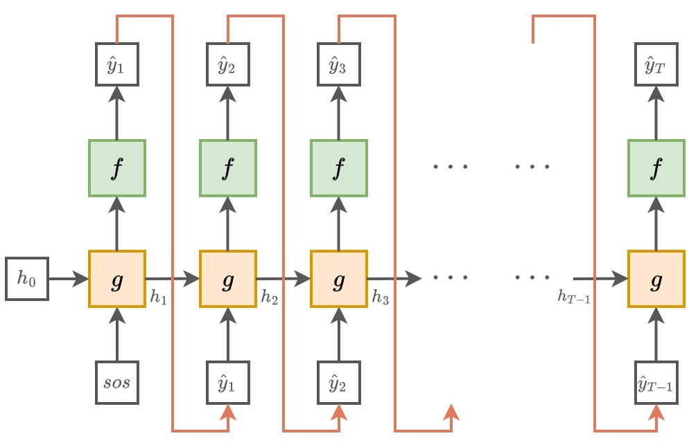
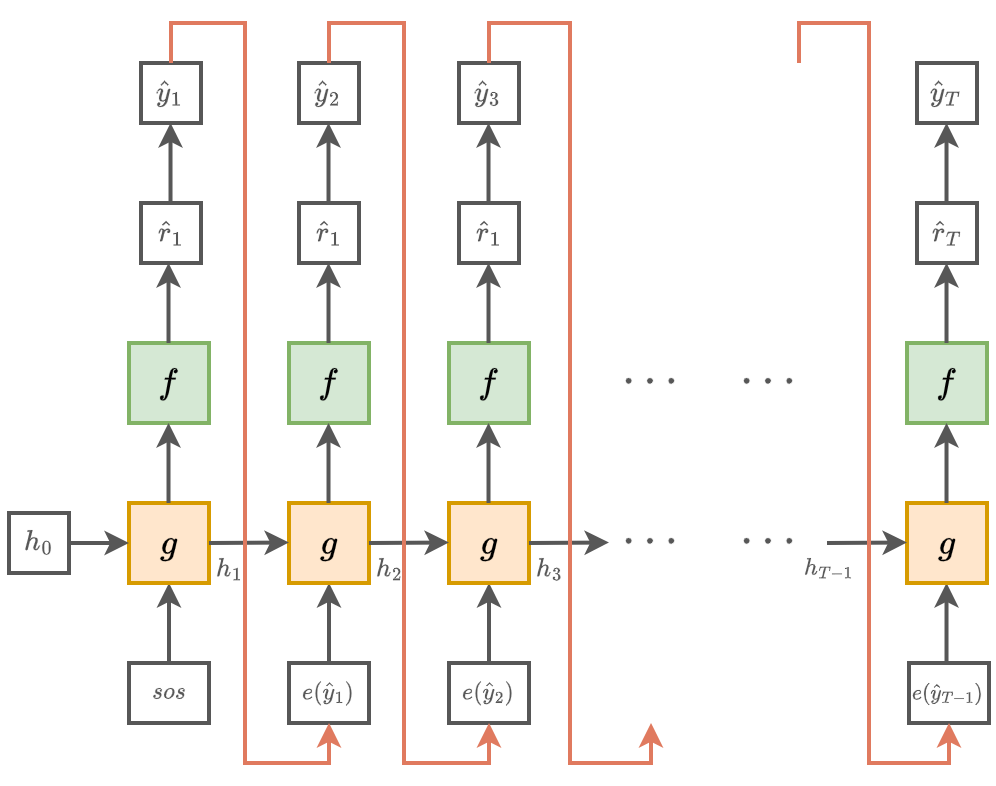

# Генерация последовательностей

[Рекуррентную сеть](RNN) можно использовать для **генерации последовательности** $\hat{\mathbf{y}}_1\hat{\mathbf{y}}_2,...\hat{\mathbf{y}}_T$, которая может представлять собой:

1. последовательность чисел (например, изменение температур);

2. последовательность вещественных векторов (например, цены на акции завтра, послезавтра, и т.д.);

3. последовательность дискретных объектов (например, цепочку слов при генерации текста).

> Простая генерация (текстов, временных рядов) не имеет прикладного смысла. Гораздо большее значение имеет **условная генерация** (conditional generation), например, когда:
> 
> - генерируется текст по заданной теме (ответ на вопрос);
> 
> - генерируется временной ряд по условию (вероятная динамика
>   будущих цен по текущей ситуации на рынке).
> 
> Поэтому безусловная генерация разрабатывается как предварительный этап перед условной генерацией в описанных далее архитектурах [one-to-many](Application-Regimes#one-to-many) и [many-to-many](Application-Regimes#many-to-many).

Для этого в начале генерации сети подаётся некоторое фиксированное начальное состояние $\mathbf{h}_0$ и фиксированный вектор начального входа $\hat{\mathbf{y}}_0$.

> Для безусловной генерации их можно задавать как нулевые вектора или как обучаемые константные векторы. В условной генерации эти вектора используются для кодировки условия, по которому нужно производить генерацию.

Последующая генерация несколько различается в зависимости от того, генерируем ли мы вектора вещественных чисел или дискретные объекты, такие как слова текста.

## Генерация векторов чисел

При генерации векторов вещественных чисел для $t=1,2,3...$ рекуррентная сеть пересчитывает внутреннее состояние и выход, <u>принимая на вход собственный выход в предыдущий момент времени</u>. Вводится дополнительная функция $p_t=s(\mathbf{h}_t)$, которая по внутреннему состоянию оценивает вероятность конца генерации $p_t$. Как только эта вероятность становится выше некоторого порогового значения (например, 0.95), генерация останавливается.

Это формализуется в виде следующего алгоритма:

> ЗАДАТЬ:
> 
> - $\mathbf{h}_0,\hat{\mathbf{y}}_0$ (например, нулевыми векторами)
> - $p_{max}$ (например, 0.95)
> 
> $t:=0$
> 
> ПОВТОРЯТЬ:
> 
> - $\mathbf{x}_t:=\hat{\mathbf{y}}_{t-1}$
> 
> - $\mathbf{h}_{t}:=g(\mathbf{x}_{t}, \mathbf{h}_{t-1})$
> 
> - $\hat{\mathbf{y}}_{t}:=f(\mathbf{x}_{t}, \mathbf{h}_{t})$ 
> 
> - $p_t:=s(\mathbf{h}_t)$
> 
> ПОКА $p_t<p_{max}$   
> 
> ВЫХОД:
> 
> - последовательность $\hat{\mathbf{y}}_1 \hat{\mathbf{y}}_2 ... \hat{\mathbf{y}}_t$

Графически указанный процесс генерации показан ниже:

## Генерация дискретных объектов

Рассмотрим, как рекуррентная сеть генерирует <u>дискретные объекты</u> на примере генерации текста (как последовательности слов). 

Для $V$ слов в словаре на каждом шаге $t$ рекуррентная сеть выдаёт $V$ рейтингов каждого слова:

$$
\hat{\mathbf{r}}=[\hat{r}_1,\hat{r}_2,...\hat{r}_V]=f(\mathbf{x}_t, \mathbf{h}_t)
$$

Эти рейтинги преобразуются в вероятности слов с помощью [SoftMax-преобразования](../MLP/Outputs-loss-functions#softmax-преобразование).

$$
\text{SoftMax}_{\tau}\left(\widehat{r}_{1},...\widehat{r}_{V}\right)=\frac{1}{\sum_{i}e^{\widehat{r}_{i}/\tau}}\cdot\left(\begin{array}{c}
e^{\widehat{r}_{1}/\tau}\\
e^{\widehat{r}_{2}/\tau}\\
\cdots\\
e^{\widehat{r}_{V}/\tau}
\end{array}\right),
$$

$$
\tau>0 - \text{гиперпараметр температуры.}
$$

- Далее генерируется самое вероятное слово либо генерируемое слово сэмплируется из предсказанного распределения. Варьируя $\tau$, можно управлять <u>противоречием между согласованностью и разнообразием</u> генерируемого текста.

На вход в следующий момент времени подаётся эмбеддинг сгенерированного слова $\mathbf{e}\left(\hat{y}_t\right)$, который можно

- брать из другой задачи (например, [Word2Vec](../Embeddings/Word2vec) или [fastText](../Embeddings/Word2vec#fasttext));

- настраивать вместе с параметрами рекуррентной сети 
  
  (для больших выборок).

Графически процесс генерации будет выглядеть следующим образом:

### Остановка генерации

Генерацию можно продолжать, пока предсказываемая вероятность остановки $p_t=s(\mathbf{h}_t)$ невелика (ниже порога). При генерации дискретных объектов также можно останавливать генерацию, когда будет сгенерирован специальный токен [EOS], означающий конец последовательности (end of sequence).

## Обучение генеративной сети

Генеративная сеть обучается на фрагментах реальных последовательностей $\mathbf{y}_1 \mathbf{y}_2 ... \mathbf{y}_T$, где целевыми значениями выступают значения той же последовательности, сдвинутые вперёд на единицу: $\mathbf{y}_2\mathbf{y}_3...\mathbf{y}_{T+1}$, чтобы сеть училась по истории последовательности предсказывать её <u>следующий элемент</u>.

> В случае предсказания временного ряда используются [регрессионные функции потерь](../MLP/Outputs-loss-functions#одномерная-регрессия), а в случае классификации - [кросс-энтропийные](../MLP/Outputs-loss-functions#кросс-энтропийные-потери-многоклассовые) между предсказанным и истинным элементом последовательности.

### Free run

Если во время обучения на вход в следующий момент времени подаётся <u>сгенерированный элемент</u> (или его эмбеддинг для дискретных объектов), то такой режим называется **free run**. Он отвечает реальному применению сети, однако требует более длительного обучения, поскольку сети сложно научиться генерировать правильно <u>всю последовательность целиком</u>. Поэтому данный подход применяется нечасто.

### Teacher forcing

Сеть будет обучаться существенно проще и быстрее, если ей упростить задачу прогнозирования. А именно, если подавать ей на вход <u>реальные элементы последовательности</u> (их эмбеддинги в дискретном случае) с предыдущего шага, а не те, которые она спрогнозировала. Так задача правильной генерации всей последовательности упрощается до правильного прогнозирования только лишь следующего элемента. Такой режим обучения называется **teacher forcing**. 

> Именно этот подход чаще всего применяется на практике во время обучения генеративных рекуррентных сетей.

Однако в режиме применения сети всё равно придётся генерировать новые последовательности на основе сгенерированных предыдущих. Если она на каком-то шаге сгенерирует неправильный вариант, то ей <u>сложнее будет восстанавливаться</u> и вернуться к правильной траектории генерации, поскольку сеть обучалась только на правильных входах (exposure bias)! 

### Объединение двух стратегий

Оптимальным с точки зрения скорости обучения и эффективности применения является комбинация двух стратегий одним из способов ниже.

**Способ 1**:

1. Обучить в режиме teacher forcing.

2. Дообучить в режиме free run.

**Способ 2**:

- Обучать одновременно в двух режимах, когда на каждом шаге $t$ с вероятностью $p$ подаётся реальный вход, а с вероятностью $(1-p)$ - сгенерированный.

- По ходу обучения можно постепенно уменьшать $p$ до нуля, что будет означать постепенный переход от teacher forcing к free run.

Второй способ называется Scheduled Sampling и был предложен в работе [[1]](https://proceedings.neurips.cc/paper/2015/hash/e995f98d56967d946471af29d7bf99f1-Abstract.html).

## Литература

1. [Bengio S. et al. Scheduled sampling for sequence prediction with recurrent neural networks //Advances in neural information processing systems. – 2015. – Т. 28.](https://proceedings.neurips.cc/paper/2015/hash/e995f98d56967d946471af29d7bf99f1-Abstract.html)

## 
