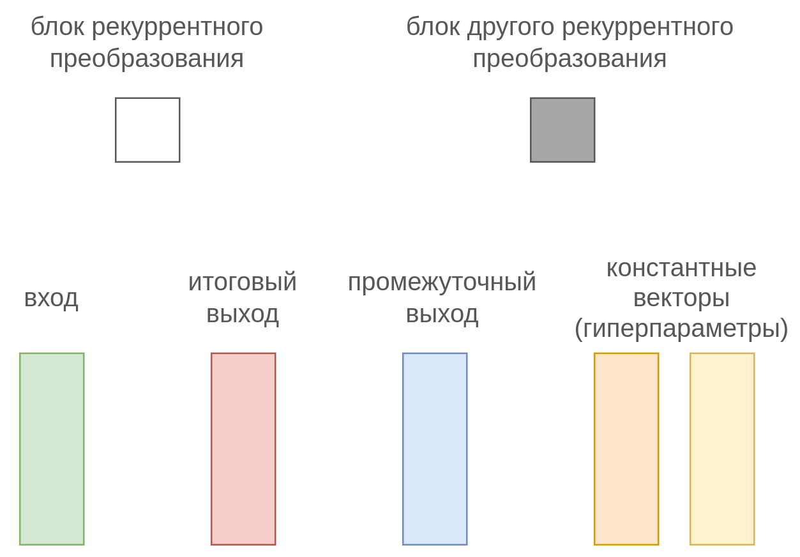
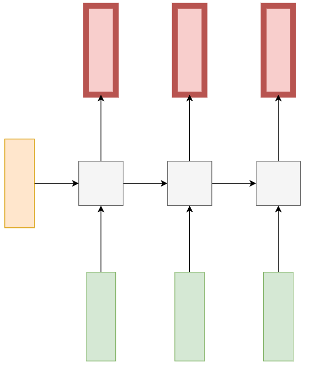
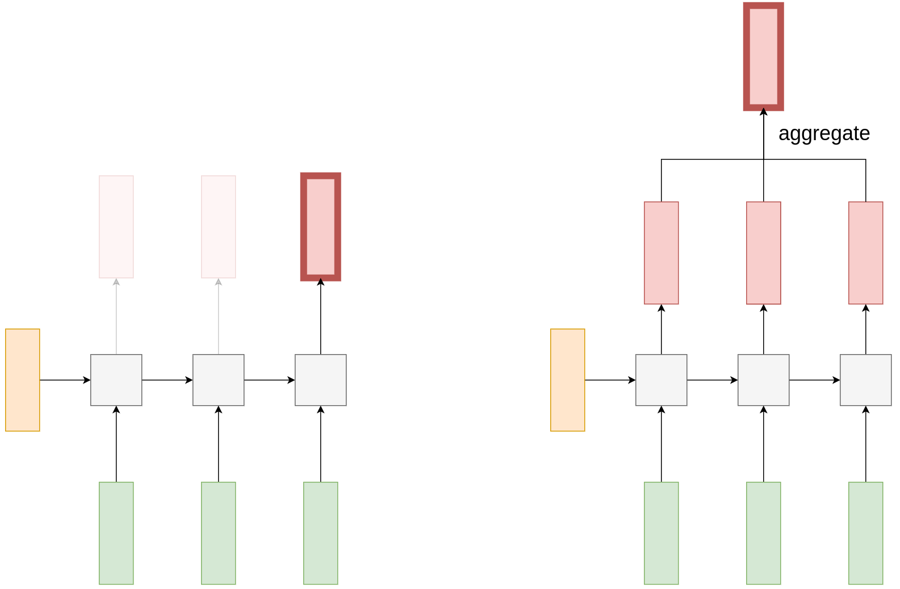
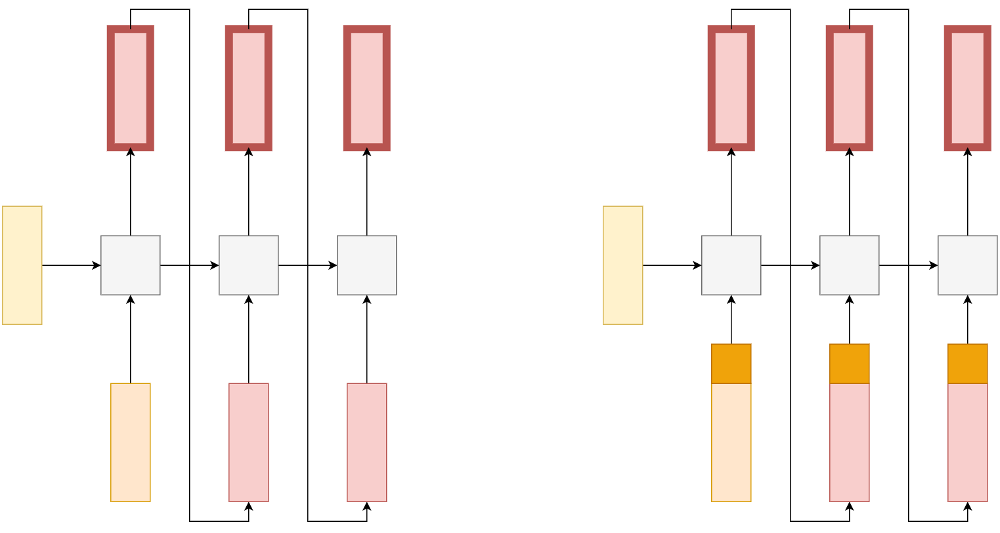
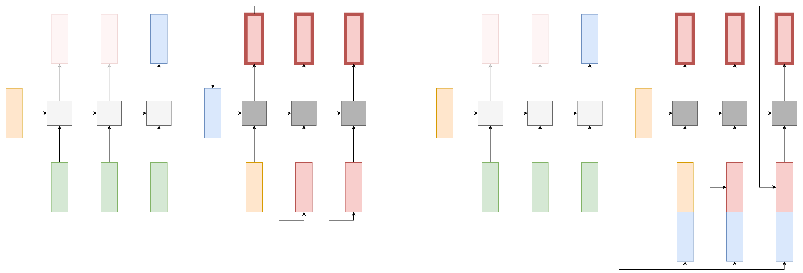

# Режимы применения рекуррентных сетей

[Рекуррентная сеть](RNN) способна работать в разных архитектурах, решающих различные задачи. Для графического описания каждой схемы будем использовать следующие условные обозначения:

## Synchronized many-to-many

**Синхронизированная many-to-many** архитектура (synchronized many-to-many) представляет собой классическое и простейшее применение рекуррентной сети, [описанное ранее](RNN#рекуррентные-сети). В этой архитектуре для каждого входа $\mathbf{x}_t$ строится соответствующий выход $\hat{y}_t$, по которому сразу можно посчитать функцию потерь $\mathcal{L}(\hat{y}_t,y_t)$. Потери от обработки всей последовательности считаются как среднее от потерь на каждом её элементе:

$$
\mathcal{L}(\widehat{Y},Y)=\frac{1}{T}\sum_{t=1}^{T}\mathcal{L}(\hat{\mathbf{y}}_{t},\mathbf{y}_{t})
$$

**Примеры использования:** 

- синхронная разметка частей речи, 

- синхронная обработка кадров видеопотока.

Это задачи, в которых нужно по динамически поступающим входам сразу генерировать их обработку.

> Особенность этой архитектуры в том, что длина выходной последовательности в точности равна длине входной последовательности.

В приведённых выше обозначениях эта схема будет выглядеть как

## Many-to-one

В архитектуре **many-to-one** на вход поступает последовательность, для которой нужно произвести <u>однократный прогноз</u>.

**Примеры использования:** 

- анализ тональности (sentiment analysis), в котором по текстовому комментарию нужно понять, он положительный, отрицательный или нейтральный;  

- классификация текста по темам, например, классификация новостей по рубрикам "экономика", "политика", "спорт" и т.д.;

- распознавание заболеваний: например, по временным данным сердцебиения определить, болен пациент или здоров;

- классификация видео по категориям, в этом случае видео представляется как последовательность кадров, а категориями могут выступать "новости", "образовательный контент", "развлекательный контент" и т.д.

Прогноз рекуррентной сети может представлять собой:

- вещественный прогноз (для регрессии);

- $C$ рейтингов классов (в задаче классификации), которые затем проходят через [SoftMax-преобразование](../MLP/Outputs-loss-functions#softmax-преобразование);

- вектор вещественных чисел фиксированной размерности, трактуемый как эмбеддинг последовательности, который затем передаётся на обработку другой модели, такой как [многослойный персептрон](../MLP/Multilayer-perceptron).

Реализовать архитектуру many-to-one можно двумя способами, описанными далее.

### Учёт последнего прогноза

В простейшем случае можно считывать выход сети <u>только на последнем шаге обработки последовательности</u>, а предыдущие выходы сети игнорировать.

> Эта схема хорошо работает для коротких последовательностей либо для последовательностей, у которых лишь по итогу её полной обработки можно делать выводы.

### Учёт всех прогнозов

Альтернативная реализация архитектуры many-to-one заключается в том, что мы <u>считываем выходы сети для каждого шага обработки последовательности, а потом агрегируем прогнозы</u> сети некоторой функцией агрегации:

$$
\hat{\mathbf{y}}=\text{aggregate}(\hat{\mathbf{y}}_1,\hat{\mathbf{y}}_2,...\hat{\mathbf{y}}_T)
$$

В качестве функции агрегации можно использовать поэлементное усреднение или взятие максимума. 

> Эта схема более предпочтительна, когда обрабатываются длинные последовательности, а характерные признаки, существенно влияющие на результат, могут встречаться в любом месте последовательности.

Графически обе реализации схемы many-to-one показаны ниже:

## One-to-many

В архитектуре **one-to-many** нужно <u>по эмбеддингу запроса сгенерировать выходную последовательность</u>. 

**Примеры использования:**

- Написать музыку в заданном жанре (music generation). Жанр задаётся эмбеддингом, например, [one-hot кодировкой](../../Machine-learning/Data-preprocessing/Categorical-preprocessing#one-hot-кодирование), а музыка представляет собой последовательность нот.

- Описать текстом, что изображено на фотографии (image captioning). Фотография пропускается через свёрточный кодировщик, выдающий эмбеддинг фотографии, а на выходе ожидается текстовое описание изображения как последовательность слов.

- Сгенерировать видео по начальному кадру (video generation from initial frame). Кадр также задаётся эмбеддингом из свёрточного кодировщика. На выходе сети ожидаем последовательность последующих кадров видео.

Реализовать эту архитектуру можно двумя способами, описанными ниже.

### Запрос через начальное состояние

В простейшем случае эмбеддинг запроса подаётся как начальное внутреннее состояние $\mathbf{h}_0$ рекуррентной сети, генерирующей выход. Первым входом генератору подаётся эмбеддинг токена [BOS] (beginning of sequence). В дальнейшем сеть генерирует ответ по уже изученной [генеративной схеме](Sequence-generation).

> Этот способ подходит, если выходная последовательность достаточно короткая. Для длинной выходной последовательности рекуррентная сеть может забыть, какой запрос был задан изначально!

### Запрос на каждом входе

Чтобы рекуррентная сеть, последовательно генерирующая выходную последовательность, не забывала исходный запрос (фото, которое нужно описать; жанр, в котором нужно сгенерировать музыку и т.д.), рекомендуется ей "напоминать" об этом запросе на каждом шаге генерации. Для этого сеть работает в [генеративном режиме](Sequence-generation), но, помимо предыдущего выхода сети (или эмбеддинга выходного объекта, если он дискретный), на вход <u>каждый раз дополнительно подаётся эмбеддинг входного запроса</u>.

Обе реализации архитектуры one-to-many показаны на схеме ниже:

## Many-to-many

В архитектуре **many-to-many** (называемой также seq2seq и encoder-decoder) требуется <u>по входной последовательности сгенерировать выходную последовательность</u>. 

**Примеры использования:**

- Машинный перевод (machine translation). Входом является предложение на исходном языке, а выходом - предложение на целевом.

- Система автоматических ответов на вопросы (question answering). Входом является вопрос пользователя, а выходом - ответ системы.

- Распознавание речи (speech recognition, speech2text). Входом является  последовательность звуков речи, представленная в виде wav-файла или спектрограммы (последовательности сил звучания каждой звуковой частоты в каждый момент времени), а выходом - распознанная речь в виде текста.

- Генерация речи (speech synthesis). Входом является текст для озвучивания (например, ответ голосового помощника), а выходом - озвучивание этого текста в виде спектрограммы или итогового wav-файла.

Реализуется эта архитектура двумя рекуррентными сетями, называемыми **кодировщиком** (encoder) и **декодировщиком** (decoder). Кодировщик решает задачу many-to-one, а декодировщик - задачу one-to-many.

Кодировочная сеть проходит по входной последовательности и кодирует её в виде эмбеддинга. Эмбеддингом может выступать как последний выход, так и агрегация выходов кодировщика по всей входной последовательности. 

По полученному эмбеддингу (кодирующему запрос) декодировщик выдаёт результат обработки в виде последовательности. Этим вектором можно инициализировать начальное состояние декодировщика либо конкатенировать его ко входу декодировщика в каждый момент времени, как показано ниже:

> Второй способ более предпочтителен, если на выходе ожидается длинная последовательность, поскольку не позволяет декодировщику забыть запрос во время генерации. 

Можно объединить оба подхода: 

- начальное состояние декодировщика инициализировать последним состоянием кодировщика (если размерности не совпадают, то можно преобразовать линейным слоем); 

- последний выход кодировщика конкатенировать к каждому входу декодировщика.

:::tip Дополнительные параметры

Для улучшенной обработки входной последовательности помимо её эмбеддинга можно передавать декодировщику дополнительную информацию, например, длину входной последовательности.

:::

Чтобы в схемах one-to-many и many-to-many понять, когда следует останавливать генерацию выходной последовательности, существует два способа: 

- генерировать выходные элементы последовательности, пока не будет сгенерирован специальный токен [EOS], означающий конец генерации;

- отслеживать отдельный выход сети, предсказывающий вероятность окончания генерации, генерация останавливается, когда эта вероятность станет выше заданного порога.
