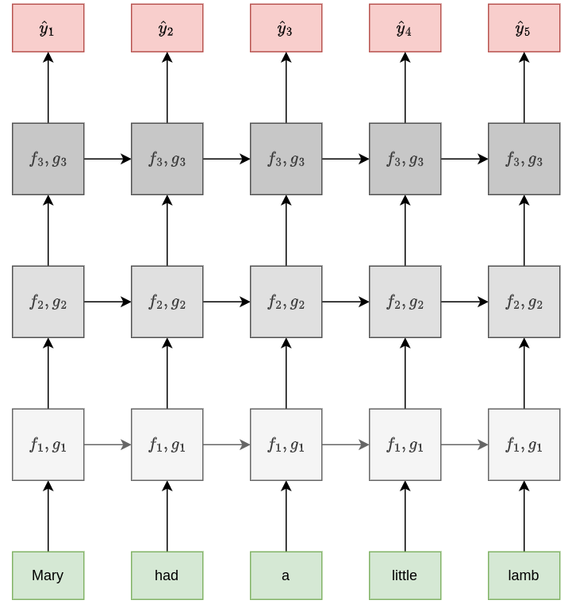
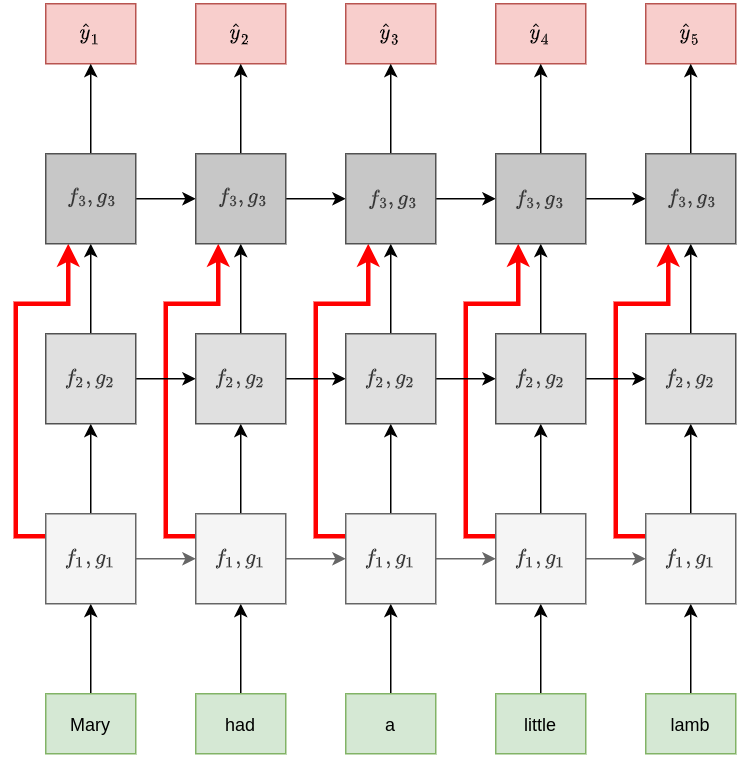
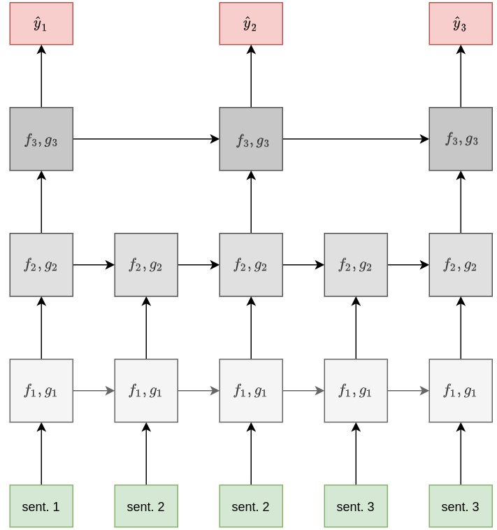
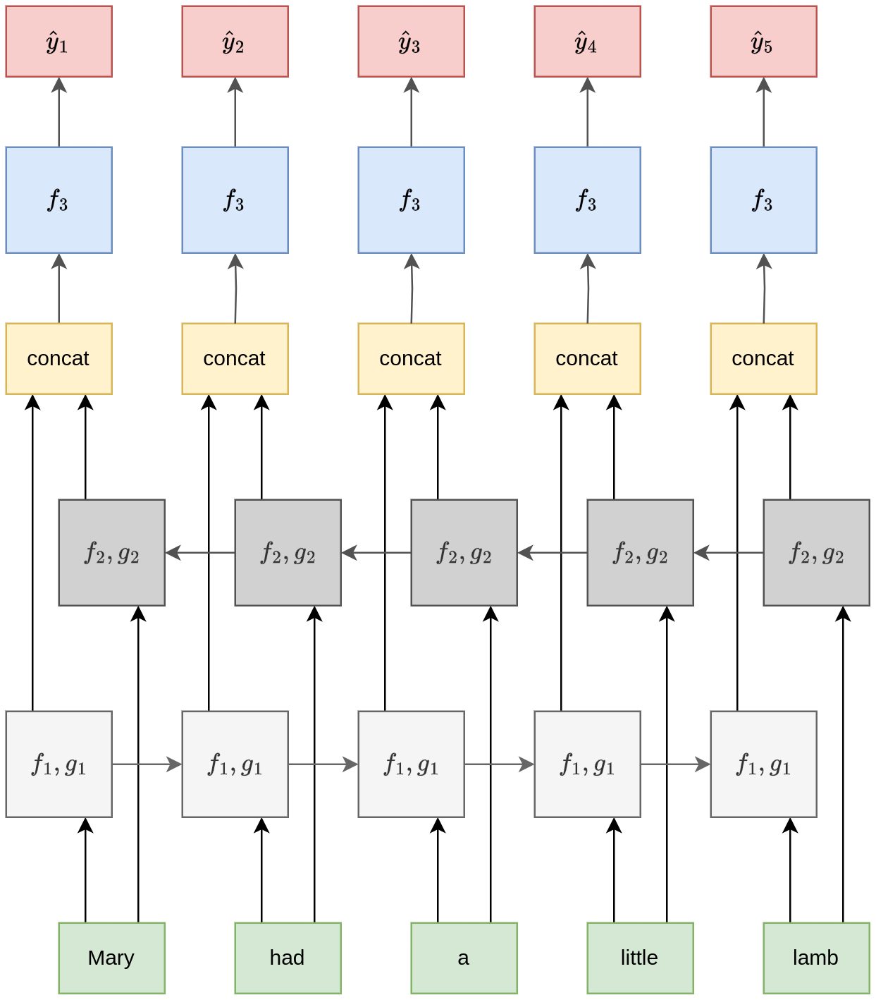
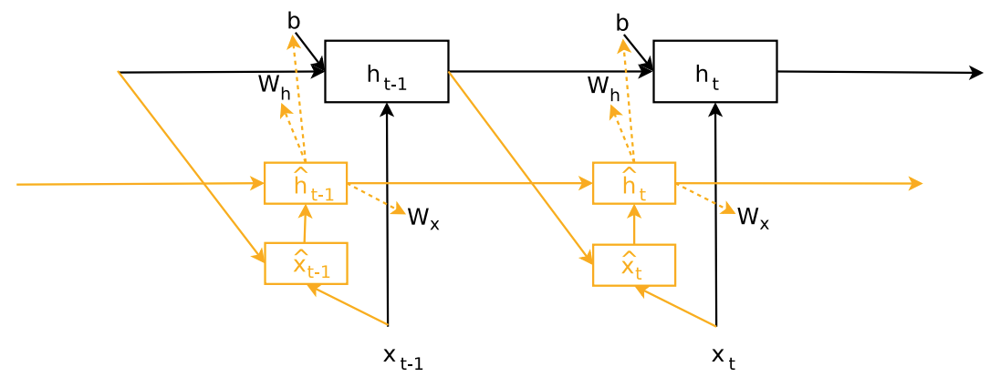

# Усложнения рекуррентных сетей

На базе [рекуррентной нейронной сети](RNN) можно строить более сложные нейросетевые архитектуры, обладающие большей выразительной силой. Опишем основные подходы. 

## Многослойные сети

Точно так же, как для получения более высокоуровневых признаков изображений мы [наслаивали несколько свёрточных слоёв](../ConvPool-Images/Conv-net), можно наслаивать несколько рекуррентных сетей друг поверх друга, как показано на рисунке:

Каждый ярус отвечает рекуррентной сети со своими параметрами. При этом рекуррентная сеть более высокого яруса принимает на вход выходы рекуррентной сети нижестоящего яруса в соответствующий момент времени.

Эта схема позволяет извлекать более сложные зависимости, основанные на нескольких нелинейных преобразованиях, и называется **многослойной рекуррентной сетью** (multilayer RNN, stacked RNN) [[1]](https://proceedings.neurips.cc/paper_files/paper/1995/hash/c667d53acd899a97a85de0c201ba99be-Abstract.html).

## Комбинация низкоуровневых и высокоуровневых признаков

В многослойной рекуррентной сети можно добавлять **тождественные преобразования** (identity connections) с более низких ярусов рекуррентной сети сразу на более высокие, минуя промежуточную обработку. Тогда входы вышестоящей рекуррентной сети будут состоять одновременно из выходов нескольких нижестоящих рекуррентных блоков. 

> Это облегчает настройку сети [методом обратного распространения ошибки](../Training/Backpropagation) (улучшает распространение градиентов) и позволяет сети верхнего яруса моделировать более сложные зависимости, комбинируя как высокоуровневые, так и низкоуровневые признаки.

Схема архитектуры:

С этим подходом мы уже сталкивались в модели [DenseNet](../Convolutional-architectures/DenseNet) при обработке изображений.

## Сlockwork RNN

Подход **clockwork RNN** [[2]](https://proceedings.mlr.press/v32/koutnik14.html) позволяет обрабатывать последовательности в разных временных масштабах. Основная идея состоит в том, что рекуррентные блоки разных ярусов многослойной рекуррентной сети (stacked RNN) обновляются с различной частотой, что позволяет модели <u>лучше помнить историю</u> и <u>эффективно обобщать информацию о длинных входных последовательностях</u>.

Ниже приведён пример такой архитектуры:

> В случае обработки текстов нижние слои сети могут обрабатывать текст на уровне слов, средние - на уровне предложений, а более высокие - на уровне параграфов, обобщая основные мысли текста в целом.

## Двунаправленная сеть

Часто строится прогноз для каждого элемента последовательности, когда <u>вся последовательность известна заранее</u>. 

> Например, при разборе слов предложения на части речи мы знаем всё предложение от начала и до конца. 

Это позволяет строить более точные прогнозы, которые учитывают <u>как левый, так и правый контекст</u> каждого элемента последовательности.

Для этого используется архитектура **двунаправленной рекуррентной сети** (bidirectional RNN, [[3]](https://www.researchgate.net/publication/3316656_Bidirectional_recurrent_neural_networks)), состоящей из двух независимых рекуррентных сетей:

- первая сеть обрабатывает элементы последовательности слева-направо;

- вторая - справа-налево.

Первая сеть кодирует входы состояниями $\overrightarrow{\mathbf{h}}_{1},\overrightarrow{\mathbf{h}}_{2},...\overrightarrow{\mathbf{h}}_{T}$, вторая - состояниями $\overleftarrow{\mathbf{h}}_{1},\overleftarrow{\mathbf{h}}_{2},...\overleftarrow{\mathbf{h}}_{T}$, 

Далее для каждого момента времени $t$ состояния обеих рекуррентных сетей конкатенируются в один вектор, кодирующий как левый, так и правый контекст:

$$
t\to \mathbf{h}_t=[\overrightarrow{\mathbf{h}}_{t};\overleftarrow{\mathbf{h}}_{t}]\in \mathbb{R}^{2D}
$$

Это объединённое состояние подаётся в качестве входа в вышестоящую сеть $f_3(\cdot)$ для последующей обработки:

У этого подхода возможны вариации:

- Верхняя сеть $f_3(\cdot)$ тоже может быть рекуррентной.

- Вместо скрытых состояний рекуррентных сетей можно использовать их выходы.

- Перед подачей на вход $f_3(\cdot)$ конкатенацию состояний можно преобразовать линейным слоем, чтобы снизить её размерность:

$$
\mathbf{x}'_t=W[\overrightarrow{\mathbf{h}}_{t};\overleftarrow{\mathbf{h}}_{t}]+\mathbf{b} \in \mathbb{R}^D
$$

Обратим внимание, что при настройке двунаправленной сети градиенты будут распространяться из каждой позиции как налево, так и направо, что усложняет настройку сети. Для длинных последовательностей нужно использовать обрезанную версию алгоритма BPTT в обе стороны (и в прошлое, и в будущее).

## Динамическая сеть

В традиционной рекуррентной сети веса для пересчёта состояний на всех итерациях обработки одинаковы. В работе [[4]](https://arxiv.org/abs/1609.09106) предлагается сделать их динамическими, предсказывая эти веса дополнительной сетью, называемой **гиперсетью** (hypernetwork). Ранее мы уже [изучали этот подход](../Special-architectures/HyperNet). Эта сеть реализует мягкую, а не жёсткую общность весов (soft weight sharing) через общность параметров гиперсети. Такая схема позволяет более гибко обрабатывать последовательности разных типов, приспосабливая под них параметры основной рекуррентной сети, выдающей итоговые результаты. 

Эта схема показана на рисунке [[4]](https://arxiv.org/abs/1609.09106):

## Литература

1. [Hihi S., Bengio Y. Hierarchical recurrent neural networks for long-term dependencies //Advances in neural information processing systems. – 1995. – Т. 8.](https://proceedings.neurips.cc/paper_files/paper/1995/hash/c667d53acd899a97a85de0c201ba99be-Abstract.html)

2. [Koutnik J. et al. A clockwork rnn //International conference on machine learning. – PMLR, 2014. – С. 1863-1871.](https://proceedings.mlr.press/v32/koutnik14.html)

3. [Schuster M., Paliwal K. K. Bidirectional recurrent neural networks //IEEE transactions on Signal Processing. – 1997. – Т. 45. – №. 11. – С. 2673-2681.](https://www.researchgate.net/publication/3316656_Bidirectional_recurrent_neural_networks)

4. [Ha D., Dai A., Le Q. V. Hypernetworks //arXiv preprint arXiv:1609.09106. – 2016.](https://arxiv.org/abs/1609.09106)
