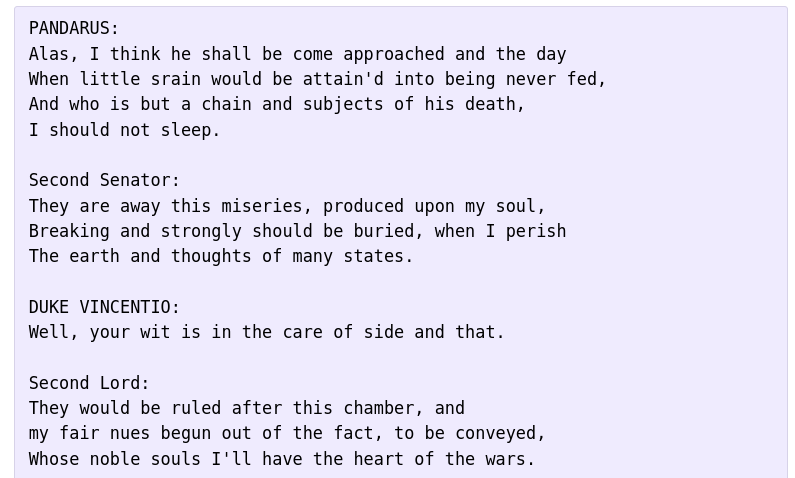
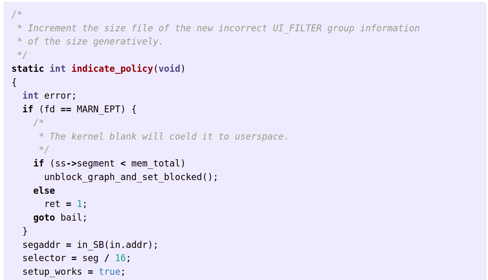

# Модели LSTM и GRU

Модели **LSTM** и **GRU** представляют собой усложнённые версии [классической рекуррентной сети](RNN) и были специально разработаны, чтобы обрабатывать длинные последовательности и лучше помнить историю из ранее виденных наблюдений.

Эти модели преобразуют входную последовательность $\mathbf{x}_1 \mathbf{x}_2 ... \mathbf{x}_T$ в последовательность состояний $\mathbf{h}_1 \mathbf{h}_2 ... \mathbf{h}_T$, использующихся внешними моделями (такими как [многослойный персептрон](../MLP/Multilayer-perceptron)), строящими уже итоговые прогнозы.

И входы, и внутренние состояния являются векторами вещественных чисел.

## Гейты в нейронных сетях

Улучшенная память моделей LSTM и GRU достигается заменой многократных перемножений матриц при учёте истории наблюдений операциями взвешенной суммы, где веса суммирования рассчитываются  специальными функциями, называемыми **гейтами** (gates). В русскоязычной литературе их также называют вентилями.

Гейты представляют собой вектора чисел, принимающими значения в отрезке [0,1], и управляют потоками данных, проходящих через нейросеть. Для этого вектора данных поэлементно домножаются на вектора гейтов. 

- Когда значение гейта равно 0, гейт закрыт и информацию не пропускает. 

- Когда значение гейта равно 1, гейт открыт, и информация свободно проходит.

Рассмотрим пример, когда нам нужно обновить состояние $\mathbf{h}_t$ по входным данным $\mathbf{x}_t$ и известному прошлому состоянию $\mathbf{h}_{t-1}$ при следующих значениях:

$$
\mathbf{x}_t=\left(\begin{array}{c}
1\\
2\\
3\\
4
\end{array}\right),\quad 

\mathbf{h}_{t-1}=\left(\begin{array}{c}
10\\
20\\
30\\
40
\end{array}\right)
$$

Мы могли бы это сделать, пропустив $\mathbf{x}_t$ и $\mathbf{h}_{t-1}$ через линейное преобразование, как сделано в [простейшей рекуррентной сети Элмана](RNN#простейшая-рекуррентная-сеть). Однако оно предполагает умножение на матрицу, которое будет производиться <u>многократно</u> при итеративной обработке последовательности и настройке сети методом [truncated BPTT](RNN#обработка-длинных-последовательностей). Это, в свою очередь, будет приводить к численной неустойчивости, сводящейся либо к тому, что сеть будет очень быстро забывать предыдущие наблюдения, либо их вклад в прогноз будет, наоборот, будет быстро возрастать. 

Чтобы решить эти проблемы, операцию умножения на матрицу предлагается заменить на вычислительно более устойчивую операцию взвешенного суммирования, где веса суммирования будут определяться гейтами.

Пусть, для примера, мы хотим обновить состояние $\mathbf{h}_t$ на нечётных позициях из входа $\mathbf{x}_t$, а на чётных позициях оставить значения предыдущего состояния $\mathbf{h}_{t-1}$. 

Это легко реализовать с помощью следующего гейта $\mathbf{g}_t$:

$$
\mathbf{g}_t=\left(\begin{array}{c}
1\\
0\\
1\\
0
\end{array}\right),\quad 1-\mathbf{g}_t=\left(\begin{array}{c}
0\\
1\\
0\\
1
\end{array}\right)
$$

и операции

$$
\mathbf{h}_t = \mathbf{g}_t\odot \mathbf{x}_t + (1-\mathbf{g}_t)\odot \mathbf{h}_{t-1},
$$

где $\odot$ обозначает поэлементное перемножение векторов. 

В итоге получим следующий результат:

$$
\mathbf{h}_t = \left(\begin{array}{c}
1\\
20\\
3\\
40
\end{array}\right)
$$

Таким образом, открытые элементы вектора гейта (=1) приводят к обновлению информации, а закрытые (=0) - к её сохранению. 

> Если информация действительно важна, то её можно сохранять очень долго, что позволяет сети, основанной на гейтах, эффективно учитывать долгосрочные зависимости в данных!

Расчёт значений гейтов реализуется линейными слоями с [сигмоидной функцией активации](../MLP/Activation-functions#сигмоидная-функция-активации-sigmoid) $\sigma(\cdot)$ на выходе.

## GRU

Модель **GRU** была предложена в [[1]](https://arxiv.org/abs/1406.1078). Формула пересчёта состояния $\mathbf{h}_t$ по входу $\mathbf{x}_t$ и предыдущему состоянию $\mathbf{h}_{t-1}$ модели GRU приведена ниже:

$$
\begin{aligned}
{\color{green}\mathbf{r_{t}}}    &=\sigma\left(W_{r}\mathbf{x_{t}}+U_{r}\mathbf{h_{t-1}}+\mathbf{b_{r}}\right) &\text{reset gate}  \\
\mathbf{{\color{brown}z}_{{\color{brown}t}}}    &=\sigma\left(W_{z}\mathbf{x_{t}}+U_{z}\mathbf{h_{t-1}}+\mathbf{b_{z}}\right)  &\text{update gate} \\
\tilde{\mathbf{h}}_t &= \text{tanh}\left(W_{h}\mathbf{x_{t}}+U_{h}\left(\mathbf{{\color{green}r_{t}}\odot h_{t-1}}\right)+\mathbf{b_{h}}\right) &\text{proposal} \\
\mathbf{h}_{t} &= \left(1-\mathbf{{\color{brown}z}_{{\color{brown}t}}}\right)\odot\mathbf{h_{t-1}}+\mathbf{{\color{brown}z_{t}}}\odot \tilde{\mathbf{h}}_t  &\text{state} \\
\end{aligned}
$$

В модели используются два гейта - гейт перезапуска $\mathbf{r}_t$ и гейт обновления $\mathbf{z}_t$. В формуле пересчёта они выделены зелёным и красным цветом.

Параметры модели:

- матрицы $W_z, U_z, W_r, U_r, W_h, U_h$;

- векторы $\mathbf{b}_{z}, \mathbf{b}_{r}, \mathbf{b}_{h}$.

## LSTM

Модель **LSTM** была предложена в [[2]](https://www.researchgate.net/publication/13853244_Long_Short-term_Memory). Формула пересчёта состояния $\mathbf{h}_t$ по входу $\mathbf{x}_t$ и предыдущему состоянию $\mathbf{h}_{t-1}$ модели LSTM приведена ниже:

$$
\begin{aligned}
{\color{green}\mathbf{f_{t}}}    &=\sigma\left(W_{f}\mathbf{x_{t}}+U_{f}\mathbf{h_{t-1}}+\mathbf{b_{f}}\right)    &\text{forget gate}\\
\mathbf{{\color{magenta}i}_{{\color{magenta}t}}}    &=\sigma\left(W_{i}\mathbf{x_{t}}+U_{i}\mathbf{h_{t-1}}+\mathbf{b_{i}}\right)    &\text{input gate} \\
\mathbf{{\color{brown}o}_{{\color{brown}t}}}    &=\sigma\left(W_{o}\mathbf{x_{t}}+U_{o}\mathbf{h_{t-1}}+\mathbf{b_{0}}\right)    &\text{output gate}\\
\tilde{\mathbf{c}}_t &= \text{tanh}\left(W_{c}\mathbf{x_{t}}+U_{c}\mathbf{h_{t-1}}+\mathbf{b_{c}}\right) &\text{proposal} \\
\mathbf{\mathbf{c}_{t}}    &=\mathbf{{\color{green}f_{t}}}\odot\mathbf{c_{t-1}}+{\color{magenta}\mathbf{i_{t}}}\odot \tilde{\mathbf{c}}_t    &\text{memory cell}\\
\mathbf{h_{t}}    &={\color{brown}\mathbf{o_{t}}}\odot \text{tanh}\left(\mathbf{c_{t}}\right)    &\text{ state}
\end{aligned}
$$

В сети используются три гейта, выделенные цветом:

- гейт забывания $\mathbf{f}_t$;

- входной гейт $\mathbf{i}_t$;

- выходной гейт $\mathbf{o}_t$.

Дополнительно используется вектор памяти (memory cell) $\mathbf{c}_t$ для внутренних вычислений. Выходом сети служит вектор состояния $\mathbf{h}_t$. 

:::tip Не совсем forget...

Как видно из формул пересчёта, открытый forget-гейт будет приводить не к забыванию памяти $\mathbf{c}_{t-1}$, а, наоборот, к сохранению! Поэтому правильнее было бы его назвать "remember gate".

:::

Параметры модели:

- матрицы $W_f, U_f, W_i, U_i, W_o, U_o, W_c, U_c$;

- векторы $\mathbf{b}_{f}, \mathbf{b}_{i}, \mathbf{b}_{o}, \mathbf{b}_{c}$.

Как видим, у LSTM больше параметров, чем у GRU. Тем не менее, GRU способна моделировать те же особенности поведения, что и LSTM. Итоговый выбор между ними нужно делать на основе сравнения качества работы этих моделей на данных.

:::tip Рекомендация по инициализации

Рекомендуется инициализировать вектор смещений $\mathbf{b}_f$ единицами, чтобы в самом начале оптимизации сеть помнила всю историю. Если это окажется излишним, то оптимизатор понизит значение смещений.

:::

> Примечательно, что модель LSTM, будучи значительно сложнее GRU, была предложена на 17 лет раньше!

## Преимущества

Используя гейты, сети GRU и LSTM могут производить следующие действия при обработке текста (как последовательности слов):

1. запоминать информацию, которая была очень давно, например, в начале предложения;

2. игнорировать часть входной информации, которая не релевантна решаемой задаче (например, комментарии или html-тэги);

3. перезапускаться "с чистого листа" по достижении логического разрыва в тексте (например, начала новой главы).

Эти же возможности доступны, если применять модели LSTM и GRU к последовательностям других типов данных.

:::note Задача

Какие гейты должны быть открыты/закрыты, чтобы GRU и LSTM реализовывали каждый из перечисленных сценариев.

:::

Как и обычные рекуррентные сети, модели GRU и LSTM могут эффективно применяться в [режимах many-to-one, one-to-many и many-to-many](Application-Regimes), а для большей выразительной силы над ними можно производить те же усложнения (наслаивание, проброс связей, двунаправленность, гиперсеть и т.д.), которые мы [изучили ранее](Extensions).

## Примеры генерации текстов

Сети LSTM и GRU можно использовать для генерации текстов, итеративно предсказывая следующее слово текста по предыдущим словам, пока не сгенерируется специальный [EOS]-токен, обозначающий конец генерации.

Например, если обучить LSTM на произведениях Шекспира, то можем получить следующий результат генерации [[3]](http://karpathy.github.io/2015/05/21/rnn-effectiveness/):

А если обучать LSTM на исходном коде Linux, то сеть будет генерировать новые реалистичные программы [[3]](http://karpathy.github.io/2015/05/21/rnn-effectiveness/):

Реализовав на базе LSTM/GRU схемы [one-to-many / many-to-many](Application-Regimes), можно производить условную генерацию (генерация текста по теме, реализация программы, выполняющей определённое действие т.д.). Отметим, что это сложные задачи, которые эффективнее решаются дополнительным подключением [механизма внимания](Attention-RNN) / использованием [модели трансформера](../Transformer).

## Альтернативные более простые подходы

Хотя LSTM и GRU представляют собой стандартные усложнения рекуррентных сетей для лучшего запоминания и учёта давних исторических наблюдений, для полноты обзора отметим и менее популярные, зато более простые подходы по модификации [рекуррентной сети Элмана](RNN#простейшая-рекуррентная-сеть) для решения той же задачи.

В [[4]](https://arxiv.org/abs/1504.00941) предложено инициализировать [матрицу пересчёта](RNN#простейшая-рекуррентная-сеть) старого состояния по новому $W_{hh}$ единичной матрицей, а вектор $\mathbf{b}_h$ - нулевыми значениями. Во время оптимизации эти параметры могут свободно меняться, однако благодаря подобной инициализации вначале сеть способна помнить всю историю, аккумулируя старые состояния.

В [[5]](https://arxiv.org/abs/1412.7753) предложено разделить внутреннее состояние $\mathbf{h}_t$ на два подвектора: быстро и медленно меняющуюся компоненту. Первая отвечает за адаптацию модели в реальном времени, а вторая - за учёт длительного исторического контекста. Быстро меняющаяся компонента пересчитывается как обычное состояние, но с учётом медленно меняющейся компоненты, которая реализуется [экспоненциальным сглаживанием](../../Machine-learning/Numerical-optimization/Monitoring#экспоненциальное-сглаживание) самой себя с новой информацией, а параметр экспоненциального сглаживания выбирается так, чтобы она менялась очень плавно и постепенно. 

## Литература

1. [Cho K. et al. Learning phrase representations using RNN encoder-decoder for statistical machine translation //arXiv preprint arXiv:1406.1078. – 2014.](https://arxiv.org/abs/1406.1078)
2. [Hochreiter S. Long Short-term Memory //Neural Computation MIT-Press. – 1997.](https://www.researchgate.net/publication/13853244_Long_Short-term_Memory)
3. http://karpathy.github.io/2015/05/21/rnn-effectiveness/
4. [Le Q. V., Jaitly N., Hinton G. E. A simple way to initialize recurrent networks of rectified linear units //arXiv preprint arXiv:1504.00941. – 2015.](https://arxiv.org/abs/1504.00941)
5. [Mikolov T. et al. Learning longer memory in recurrent neural networks //arXiv preprint arXiv:1412.7753. – 2014.](https://arxiv.org/abs/1412.7753)
