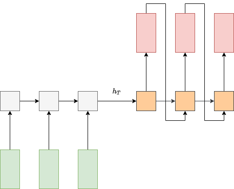
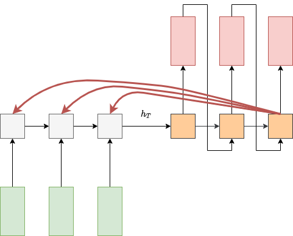
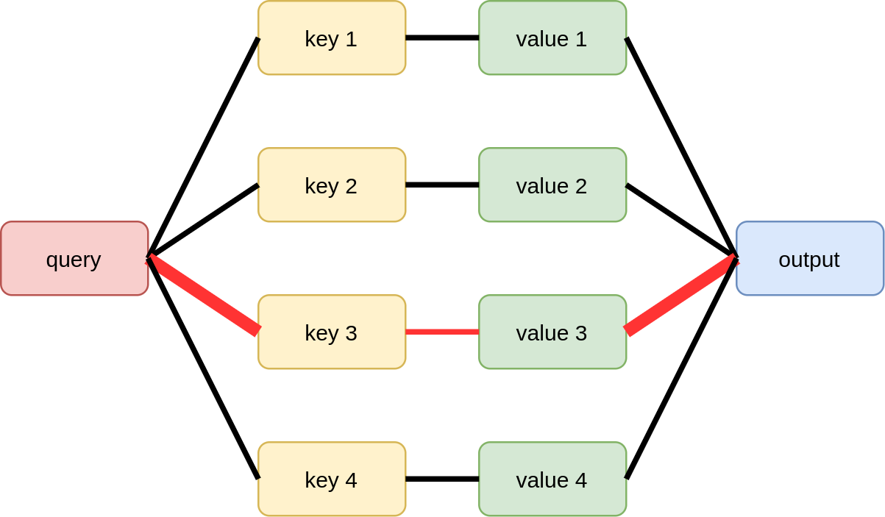
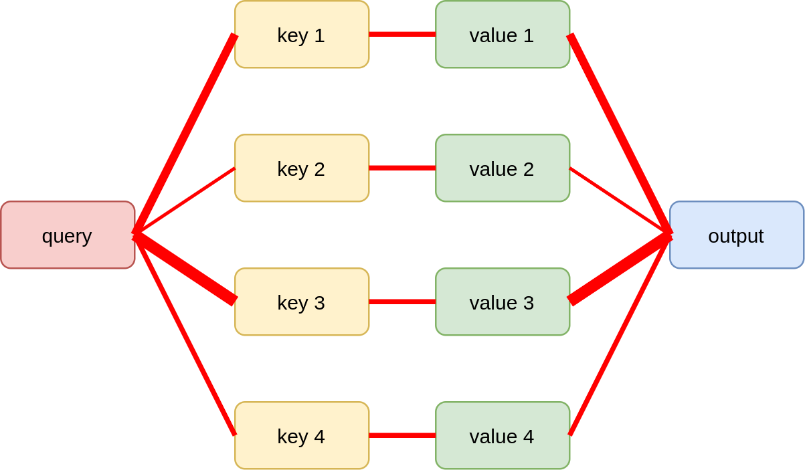
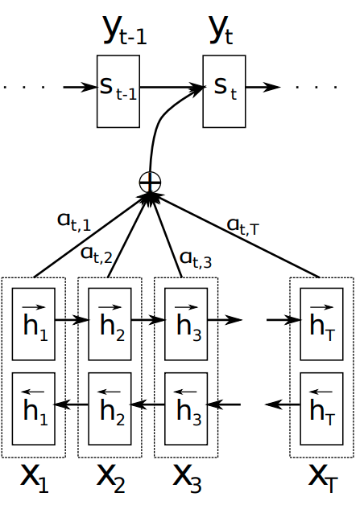
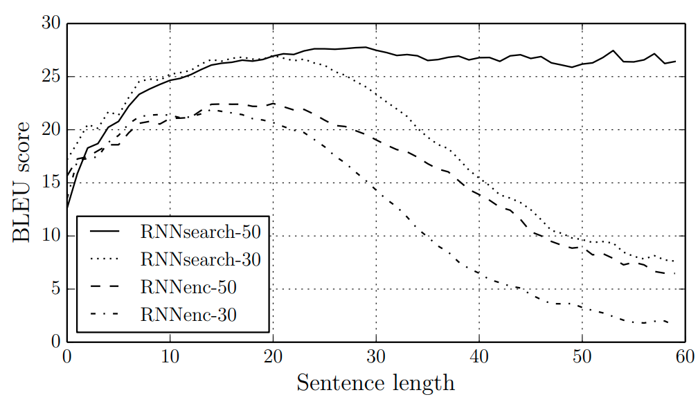
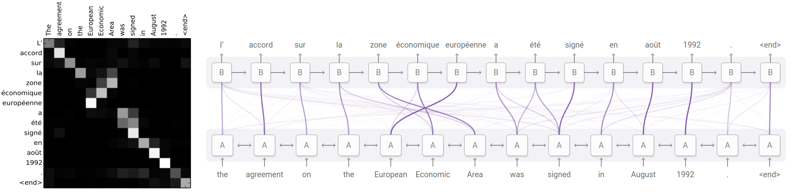
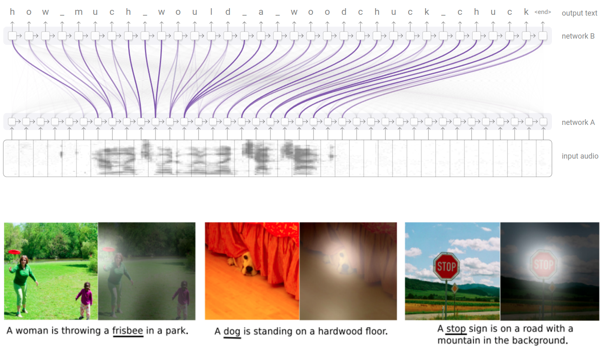

# Механизм внимания в рекуррентных  сетях

[Рекуррентные нейронные сети](RNN) призваны обрабатывать входные данные в виде последовательности элементов произвольной длины. Центральная задача при обработке таких данных - это <u>полноценный учёт исторических элементов последовательности</u>, которые нейросеть уже пронаблюдала. 

Базовая [модель Элмана](RNN#простейшая-рекуррентная-сеть) способна обрабатывать лишь короткие последовательности, поскольку обращение к более ранней истории наблюдений связано с многократным перемножением матриц в архитектуре сети, из-за чего информация о давних наблюдениях теряется. 

Рекуррентные сети, основанные на [гейтах](LSTM-GRU#гейты-в-нейронных-сетях), такие как [LSTM и GRU](LSTM-GRU), позволяют лучше учитывать раннюю историю за счёт замены численно неустойчивых многократных перемножений матриц на взвешенные суммы, что позволяет помнить историю лучше и эффективнее учитывать её в прогнозах.

Однако даже эти модели не могут полноценно обработать слишком длинные последовательности, поскольку вынуждены хранить информацию о всех ранее виденных наблюдениях (которых может быть очень много) в векторе скрытого состояния фиксированного размера.

Для более эффективной обработки длинных последовательностей в нейронных сетях используется **механизм внимания** (attention mechanism [[1]](https://en.wikipedia.org/wiki/Attention_(machine_learning))), позволяющий на этапе генерации выхода <u>обращаться к любому элементу входной последовательности напрямую</u>, при котором потери информации не может быть в принципе!

> Цена за подобное усовершенствование - <u>повышенные расходы на память и вычисления</u>, поскольку теперь при генерации каждого выхода сети приходится помнить всю входную последовательность и обращаться ко всем ранее виденным её элементам. 

Далее мы разберём механизм внимания более подробно на примере рекуррентной сети для задачи машинного перевода. Те же самые принципы могут использоваться для обработки последовательностей любого типа.

## Идея внимания

Рассмотрим задачу машинного перевода (machine translation), то есть автоматического перевода текста на с одного языка на другой. Эту задачу можно решить архитектурой [many-to-many](Application-Regimes#many-to-many), используя две рекуррентные сети - **кодировщик** и **декодировщик**, как показано на схеме:

Кодировщик проходит по токенам входной последовательности (словам на исходном языке), после чего её итоговое внутреннее состояние кодирует всю эту последовательность целиком в виде вектора фиксированного размера $\mathbf{h}_T$.

Внутреннее состояние декодировщика инициализируется состоянием $\mathbf{h}_T$ и осуществляет генерацию перевода в [авторегрессионном режиме](Application-Regimes#many-to-many), при котором выход сети в предыдущий момент времени является входом в следующий момент времени.

Указанная архитектура обладает тем недостатком, что переводимый текст может быть произвольной длины, но конструктивно его приходится кодировать в виде <u>вектора фиксированного размера</u> $\mathbf{h}_T$, что приводит к потере информации о тексте, если он окажется слишком длинный (чем длиннее - тем больше потеря информации).

В статье [[2]](https://arxiv.org/abs/1409.0473) предложено использовать **механизм внимания** (attention mechanism), чтобы при генерации каждого выходного токена декодировщик мог смотреть <u>на все токены входной последовательности</u>, как показано на рисунке:

> Так кодировочной сети не придётся запоминать каждый входной токен, и потери информации не произойдёт. 

Заметим, что внимание нацелено на все входные токены, а не на какой-то один (soft attention). Это объясняется особенностями настройки нейросетей и позволяет повысить точность перевода, учитывая не только сами слова, но и контекст соседних слов, в котором они находятся.

> Например, слово "замок" может быть переведено как "castle" или как "lock". Для разрешения неоднозначности необходимо анализировать соседние слова:
> 
> - Замок имеет шесть башен и окружён глубоким рвом -> castle.
> 
> - Замок заржавел, и ключ в нём не поворачивается -> lock.
> 
> В первом случае внимание восстановит смысл по таким словам, как "башня" и "ров". А во втором - по слову "ключ".

Технически механизм внимания использует три сущности:

- **запросы** (queries);

- **ключи** (keys);

- **значения** (values).

Его работа вдохновлена SQL-запросами к базе данных вида 

select VALUE where KEY=QUERY

в которых считывается значение записи (VALUE), у которой ключ (KEY) совпадает с запросом (QUERY).

Графически это можно представить следующим образом:

Реализовать подобный механизм напрямую в нейронных сетях нельзя, поскольку для их настройки необходимо использовать [дифференцируемые преобразования](../Training/Opt-methods-fixed-lr), а функция, осуществляющая запрос, представляет собой <u>дискретную операцию</u>. 

Поэтому в нейросетях используется сглаженный вариант **мягкого внимания** (soft attention), вычисляющий <u>функцию сходства запроса с каждым ключом</u>, а затем усредняющий все значения <u>пропорционально этой функции сходства</u>. 

Это можно проиллюстрировать следующим образом, где толщина линий обозначает степень сходства запроса и ключей, а также веса, с которыми соответствующие значения потом агрегируются для получения итогового ответа:

Более конкретно, в работе [[2]](https://arxiv.org/abs/1409.0473) в качестве кодировщика использована [двунаправленная рекуррентная сеть](Extensions#двунаправленная-сеть), сопоставляющая эмбеддингу каждого входного токена $\mathbf{x}_n$ векторы двух внутренних состояний  $\overrightarrow{\mathbf{h}}_n$ и $\overleftarrow{\mathbf{h}}_n$ для рекуррентных сетей, проходящих слева направо и справа налево. Эти состояния конкатенируются в один вектор:

$$
\mathbf{h}_n=[\overrightarrow{\mathbf{h}}_n, \overleftarrow{\mathbf{h}}_n],
$$

представляющий собой эмбеддинг слова с учётом его левого и правого контекста, то есть в контексте <u>всего входного текста</u>. Эти эмбеддинги в [[2]](https://arxiv.org/abs/1409.0473) представляют собой одновременно и ключи, и значения для всех $T$ входных токенов.

Декодировочная сеть представляет собой рекуррентную сеть, идущую слева направо и имеет внутреннее состояние $\mathbf{s}_m$, пересчитываемое с использованием механизма внимания. Запросом выступает текущее состояние декодировщика $\mathbf{s}_m$, а ключами и значениями - состояния кодировщика для всех элементов входной последовательности.

Генерация состояния $\mathbf{s}_t$ декодировщика состоит из следующих этапов:

1. Вычисляется степень соответствия каждого входного токена текущему состоянию, используя функцию score: 

$$
e_{tj}=\text{score}\left(\mathbf{s}_{t-1}, \mathbf{h}_{j}\right),j=1,2,...T,
$$

где $T$ - длина входного текста (число токенов).

2. Вычисляются веса учёта состояний кодировочной сети. Для этого степени соответствия пропускаются через [SoftMax-преобразование](../MLP/Outputs-loss-functions#softmax-преобразование): 

$$
\alpha_{ti}=\exp(e_{ti})/\sum_{j=1}^{T}\exp(e_{tj}),\;j=1,2,...T
$$

3. Вычисляется контекстный вектор, объединяющий информацию об интересующих входных токенах в контексте текущего запроса:

$$
\mathbf{c}_{t}=\sum_{j}\alpha_{tj}\mathbf{h}_{j}
$$

4. Осуществляется пересчёт состояния декодировочной сети, используя состояние, выход сети <u>и контекстный вектор</u> с предыдущего шага:

$$
\mathbf{s}_{t}=f\left(\mathbf{s}_{t-1}, \mathbf{y}_{t-1}, \mathbf{c}_{t}\right)
$$

Графически это можно представить следующим образом [[2]](https://arxiv.org/abs/1409.0473):

:::tip Вычислительные требования

Как видим, рекуррентная сеть со вниманием имеет повышенные требования на память и вычисления по сравнению с обычной:

- требуется хранить ключи и значения (внутренние состояния кодировщика)

- при генерации каждого выходного токена нужно вычислять и учитывать контекстный вектор, причём сложность его вычисления пропорциональна длине всей входной последовательности.

Поэтому на практике длинную входную последовательность разбивают на отдельные блоки и обрабатывают их независимо. В машинном переводе естественно переводить не весь текст целиком, а каждое предложение по отдельности.

:::

## Вычисление соответствий

Вычислять соответствия между запросом и ключами можно по-разному. Ниже приведены основные варианты:

| английское название | формула                                                                                                        |
| ------------------- | -------------------------------------------------------------------------------------------------------------- |
| dot-product         | $\mathbf{s}^{T}\mathbf{h}$                                                                                     |
| scaled dot-product  | $\mathbf{s}^{T} \mathbf{h}/\sqrt{d}\;$  для $\mathbf{s},\mathbf{h}\in\mathbb{R}^d$                             |
| content-based       | $\mathbf{s}^{T}\mathbf{h}/\left(\left\lVert \mathbf{s}\right\rVert \left\lVert \mathbf{h}\right\rVert \right)$ |
| additive            | $w^{T}\tanh\left(W_{1}\mathbf{s}+W_{2}\mathbf{h}\right)$                                                       |
| multiplicative      | $\mathbf{s}^{T}W\mathbf{h}$                                                                                    |
| feed-forward        | $\text{MLP}(\mathbf{s},\mathbf{h})$                                                                            |

Самым общим способом вычисления соответствия является применение [многослойного персептрона](../MLP/Multilayer-perceptron) (MLP) к запросу и ключу. Additive attention является частным случаем, когда используется всего один скрытый слой с [активацией гиперболического тангенса](../MLP/Activation-functions#гиперболический-тангенс-tangh).

## Результат использования

Использование механизма внимания в [[2]](https://arxiv.org/abs/1409.0473) позволило значительно повысить качество машинного перевода, измеренное по мере [BLEU](https://en.wikipedia.org/wiki/BLEU), особенно для длинных текстов. 

Ниже приведено среднее значение этой меры при обучении на предложениях длиной до 30 и до 50 слов

- обычной many-to-many архитектурой (RNNenc)

- many-to-many архитектурой с использованием внимания (RNNsearch) [[2]](https://arxiv.org/abs/1409.0473).

Чем BLEU выше, тем модель осуществляет более точный перевод. Как видим, нейросеть с механизмом внимания работает точнее обычной many-to-many архитектуры, а её качество тем выше, чем на более длинных предложениях она обучалась. 

## Интерпретируемость

Помимо повышения точности, другим важным преимуществом сети со вниманием является возможность интерпретации её работы за счёт визуализации весов внимания.

Это можно делать для каждого выходного токена $\{\alpha_{ti}\}_i$, а можно визуализировать все веса $\{\alpha_{ti}\}_{ti}$ сразу в виде матрицы внимания (attention matrix) $M\in\mathbb{R}^{T\times K}$, где 

- $T$ - длина входного предложения,

- $K$ - длина выходного предложения (перевода),

а $j$-й столбец содержит вектор вниманий при генерации $j$-го выходного токена [[1]](https://arxiv.org/abs/1409.0473):

> При корректно настроенном переводчике эта матрица будет <u>близка к диагональной</u>, поскольку последовательным входным словам обычно соответствуют последовательные выходные, за редкими исключениями, как в примере выше, когда "European Economic Area" по-французски переводится как "zone économique européen".

## Другие применения

Предложенная архитектура со вниманием может эффективно использоваться и в других приложениях, таких как распознавание речи по спектрограмме (speech recognition) и текстовом описании изображений (image captioning), как показано на рисунке сверху и снизу [[3]](https://distill.pub/2016/augmented-rnns/):

При распознавании речи о корректности настройки модели также можно судить по тому, насколько <u>матрица внимания оказалась близка к диагональной</u>, поскольку последовательным звукам должны соответствовать последовательно распознанные символы.

При описании изображений входом является не последовательность, а всё изображение целиком, представленное в виде промежуточного представления изображения внутри свёрточного кодировщика (например, на промежуточном слое сети [VGG](../Convolutional-architectures/VGG))  $X\in\mathbb{R}^{H\times W \times C}$. Запросами в механизме внимания выступает внутреннее состояние рекуррентной сети декодировщика, последовательно генерирующей слова. А ключами и значениями выступают преобразованные $C$-мерные векторы внутреннего представления изображения. Поскольку для этих векторов известны их координаты, то можно определить, <u>куда было нацелено внимание</u> сети на изображении, когда декодировщик генерировал каждое слово. Если слово соответствует правильному объекту на изображении, как для слова frisbee выше, то это свидетельствует в пользу того, что нейросеть настроилась корректно и [не переобучилась](../../Machine-learning/Base-concepts/Generalization-ability).

## Литература

1. [Wikipedia: Attention (machine learning).](https://en.wikipedia.org/wiki/Attention_(machine_learning))
2. [Bahdanau D. Neural machine translation by jointly learning to align and translate //arXiv preprint arXiv:1409.0473. – 2014.](https://arxiv.org/abs/1409.0473)
3. [distill.pub: Attention and Augmented Recurrent Neural Networks.](https://distill.pub/2016/augmented-rnns/)
