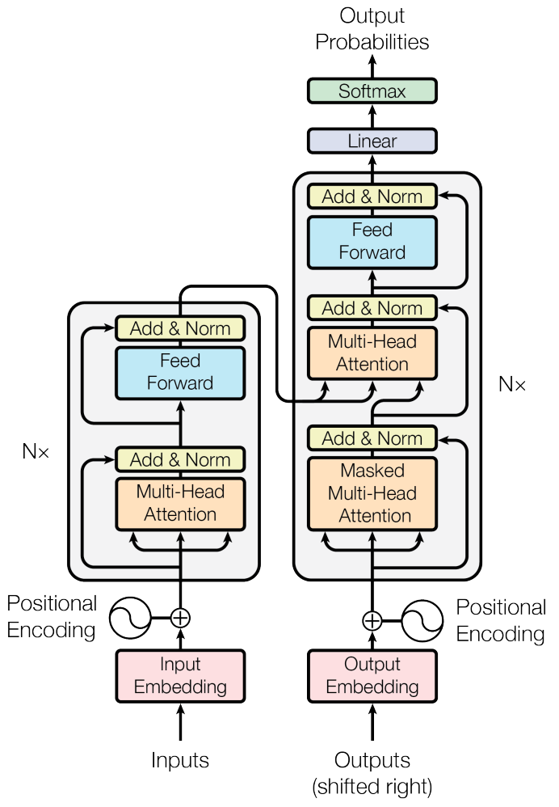

# Трансформер

**Трансформер** (transformer) - это нейросетевая модель, призванная более эффективно решать задачи [many-to-many](../Recurrent-neural-nets/Application-Regimes#many-to-many) (seq2seq) по преобразованию одной последовательности в другую. Последовательностями могут выступать:

- текст как последовательность слов;

- видео как последовательность кадров;

- звук как последовательность частот звуковых волн.

Примерами таких задач могут быть

- система ответов на вопросы (вопрос - входная последовательность, ответ - выходная);

- распознавание речи (входная последовательность - звук в виде спектрограммы, выходная - распознанная речь в виде текста);

- прогнозирование временных рядов (входная последовательность - начало ряда, выходная - его продолжение);

- музыкальная композиция (входная последовательность - текст песни, выходная - последовательность нот).

> В частности, семейство моделей ChatGPT (GPT-3, GPT-3.5, GPT-4 и др. [[1]](https://en.wikipedia.org/wiki/ChatGPT)) расшифровывается как generative pre-trained transformer и построена на базе трансформерной архитектуры!

:::tip За пределами many-to-many

Отдельные элементы трансформера, такие как блок **самовнимания** (self-attention), используются и в других подходах, таких как one-to-one (классификация, генерация изображений), one-to-many (текстовое описание изображений), many-to-one (классификация текста), что позволяет говорить и о других видах трансформеров. 

Например, использование самовнимания на изображениях называется **визуальным трансформером** (visual transformer). Поскольку трансформер работает над последовательностями, изображения в нём разбиваются на фрагменты, после чего идёт работа с каждым фрагментом как с элементом последовательности.

:::

Здесь же мы рассмотрим обработку классических последовательностей, заданных в явном виде, например, последовательность слов в тексте.

Для примера будем рассматривать задачу **машинного перевода** (machine translation), состоящую в автоматическом переводе текста с одного языка на другой. Тем более, именно для этой задачи трансформер и был впервые предложен.

Ранее мы изучили, что для лучшей запоминаемости входной последовательности рекуррентную  [many-to-many архитектуру](../Recurrent-neural-nets/Application-Regimes#many-to-many) дополняют [механизмом внимания](../Recurrent-neural-nets/Attention-RNN) (attention). В этом случае на этапе генерации выходной последовательности всё ещё используется обученная рекуррентая сеть, которой приходилось запоминать весь уже сгенерированный контекст в скрытом состоянии. Поскольку он представлялся вектором фиксированного размера, то это всё ещё приводит к потере информации о ранее сгенерированном контексте. Эту проблему можно решить <u>повторным применением механизма внимания к уже сгенерированным токенам</u>, что и предложено в модели **трансформера** (transformer) [[2]](https://user.phil.hhu.de/~cwurm/wp-content/uploads/2020/01/7181-attention-is-all-you-need.pdf), в котором полностью отказались от рекуррентности в кодировщике и декодировщике, заменив работу с историей блоками внимания. 

> Собственно, поэтому статья [[2]](https://user.phil.hhu.de/~cwurm/wp-content/uploads/2020/01/7181-attention-is-all-you-need.pdf) и называется - "Attention is all you need". Она является одной из самых цитируемых работ по глубокому обучению, поскольку в ней был впервые предложен принципиально другой и более эффективный подход к обработке последовательностей.

Предложенная модель трансформера сумела существенно повысить качество машинного перевода и стала повсеместно применяться для обработки и генерации последовательностей, вытесняя рекуррентные сети во всех случаях, кроме обработки коротких последовательностей и ситуаций, когда модель должна быть более вычислительно эффективной по вычислениям и памяти.

> Стоит отметить, что, поскольку трансформер основан исключительно на легко параллелизуемом механизме внимания без использования рекуррентности, это позволяет <u>обучать его быстрее</u> на видеокарте <u>с достаточными вычислительными ресурсами и объёмом памяти</u>.

## Архитектура трансформера

Схема модели трансформера приведена ниже [[2]](https://user.phil.hhu.de/~cwurm/wp-content/uploads/2020/01/7181-attention-is-all-you-need.pdf):

Трансформер состоит из двух блоков: **кодировщика** (encoder), расположенного на схеме слева, и **декодировщика** (decoder), расположенного справа. Кодировщик и декодировщик выделены прозрачными прямоугольниками.

## Применение трансформера

Обработка последовательностей, как обычно, происходит [минибатчами](../Training/Opt-methods-fixed-lr#стохастический-градиентный-спуск-по-мини-батчам). $T$ - максимальная длина входной последовательности в минибатче последовательностей длин $T_1,T_2,...T_B$:

$$
T=\max\{T_1,T_2,...T_B\}
$$

Поскольку последовательности будут иметь разную длину, то каждая из них дополняется специальным токеном [EOS] (end of sequence), означающим конец последовательности, а более короткие последовательности после [EOS] дополняются спец. токеном [PAD], чтобы все они в итоге оказались одной длины для параллельной обработки.

> Рассмотрим пример машинного перевода с русского языка на английский. Минибатч, состоящий из трёх предложений на русском
> 
> - [Город располагается на берегу реки]
> 
> - [В центре находится парк]
> 
> - [Популярное место]
> 
> будет представлен как
> 
> - [Город располагается на берегу реки EOS]
> 
> - [В центре находится парк EOS PAD]
> 
> - [Популярное место EOS PAD PAD PAD]

## Кодировщик

На вход кодировщику поступает входная последовательность из $T$ токенов (слов), каждый из которых кодируется $D$-мерным эмбеддингом (input embedding), <u>обучаемым вместе с настройкой самой сети</u> (для ускорения настройки их можно инициализировать и [готовыми эмбеддингами](../Embeddings/Word2vec)). 

> Поскольку в кодировщике полностью отказались от рекуррентности, он может параллельно обрабатывать всю входную последовательность, что существенно ускоряет его работу при наличии достаточных для этого вычислительных ресурсов и памяти.

Но информация о расположениях токенов внутри последовательности теряется. Чтобы модели в явном виде сообщить, какие токены где располагались, к эмбеддингу каждого токена на входе в декодировщик прибавляется эмбеддинг той же размерности, кодирующий абсолютное расположение эмбеддинга Это называется [позиционным кодированием](Positional-encoding) (positional encoding).

Выходом кодировщика является $T$ эмбеддингов входных элементов последовательности, <u>уточнённых с учётом контекста всей последовательности</u>.

> Рассмотрим две последовательности:

:::tip Блоки кодировщика

Кодировщик состоит из $N$ последовательно применяемых [блоков кодировщика](Encoder-self-attention), каждый - со своими параметрами. В работе [[2]](https://user.phil.hhu.de/~cwurm/wp-content/uploads/2020/01/7181-attention-is-all-you-need.pdf) бралось $N=6$.

:::

## Декодировщик

Декодировщик работает аналогичным образом, только ему подаются эмбеддинги не входных токенов (слова на русском), а выходных (слова на английском, при переводе с русского на английский).

В режиме обучения - это слова корректного перевода (режим [teacher forcing](../Recurrent-neural-nets/Sequence-generation#обучение-генеративной-сети)), а в режиме применения - это слова, которые трансформер сам сгенерировал ранее.

### Обучение декодировщика

Во время обучения декодировщику подается на вход <u>выходная</u> последовательность (корректный перевод на английском), сдвинутая на единицу специальным токеном [BOS] (beginning of sequence) и законченная токеном [EOS] (end of sequence) c дополнением [PAD] для выравнивания по максимальной длине выходной последовательности в минибатче.

> Например, обучающий минибатч ответов
> 
> - [The city is located on the river bank]
> 
> - [There is a park in the center]
> 
> - [A popular place]
> 
> будет закодирован как
> 
> - [BOS The city is located on the river bank EOS]
> 
> - [BOS There is a park in the center EOS PAD]
> 
> - [BOS A popular place EOS PAD PAD PAD PAD PAD]
> 
> для выравнивания длин всех последовательностей.

На выходе кодировщик выдаёт эмбеддинг для каждого токена перевода, к каждому из которых в отдельности применяется линейный слой (Linear на схеме) и [SoftMax-преобразование](../MLP/Outputs-loss-functions#softmax-преобразование), выдающее вероятностное распределение на возможных словах перевода, по которым можно предсказать уже само слово, выбрав самое вероятное.

> Таким образом, по входу 
> 
> [BOS A popular place EOS PAD PAD PAD PAD PAD]
> 
> ожидается выход
> 
> [A popular place EOS X X X X X X]
> 
> где по позициям X потери уже не считаются, поскольку всё, что следует после токена [EOS], не будет участвовать в выходе сети.

:::tip Параллелизация

Поскольку ни кодировщик, ни декодировщик не используют рекуррентности, то их можно обучать синхронно на <u>всей последовательности целиком</u>. Это свойство позволило обучать трансформер гораздо быстрее, чем рекуррентные сети, решающие ту же задачу.

:::

### Применение декодировщика

Во время применения <u>кодировщик</u> всё так же может обрабатывать входную последовательность параллельно, поскольку она известна целиком. 

А вот выходная последовательность заранее неизвестна, поэтому <u>декодировщик</u> запускается много раз в авторегрессионном режиме (генерируя слова перевода последовательно одно за другим) до тех пор, пока не будет сгенерирован токен [EOS], означающий конец генерации.

> Например, при переводе [Популярное место]->[Popular place EOS] после получения токена [EOS] генерация останавливается. 

На каждом запуске декодировщик может предсказывать распределение вероятностей на всех уже сгенерированных токенах, но нас интересует <u>только последнее сгенерированное слово</u>, чтобы дополнить им выходную последовательность.

:::tip Блоки декодировщика

Декодировщик состоит из $N$ последовательно применяемых блоков декодировщика, описанных [далее](Decoder),  каждый - со своими параметрами. В работе [[2]](https://user.phil.hhu.de/~cwurm/wp-content/uploads/2020/01/7181-attention-is-all-you-need.pdf) бралось $N=6$.

:::

---

Далее будет детально рассмотрена архитектура отдельных блоков [кодировщика](Encoder-self-attention) и [декодировщика](Decoder). Мы изучим, как дополнить каждый входной токен информацией о его расположении во входной последовательности, используя [позиционное кодирование](Positional-encoding), а также разберём технические детали [обучения трансформера](Training-transformer).

## Литература

1. [Wikipedia: ChatGPT.](https://en.wikipedia.org/wiki/ChatGPT)
2. [Vaswani A. Attention is all you need //Advances in Neural Information Processing Systems. – 2017.](https://user.phil.hhu.de/~cwurm/wp-content/uploads/2020/01/7181-attention-is-all-you-need.pdf)
