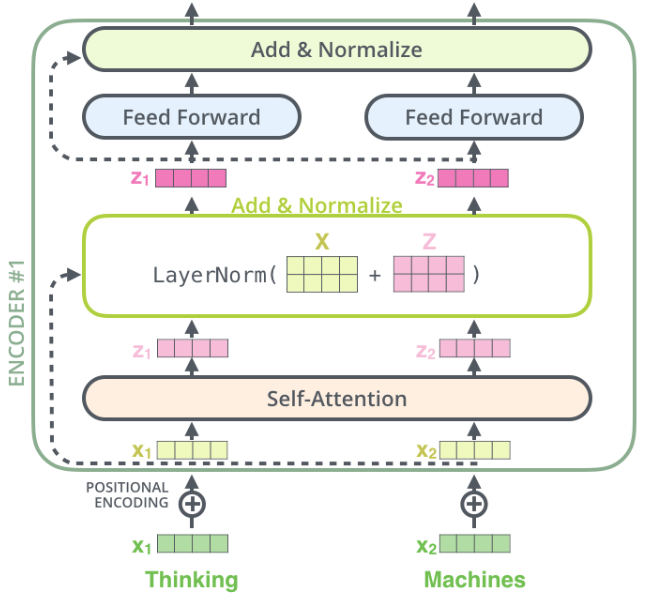
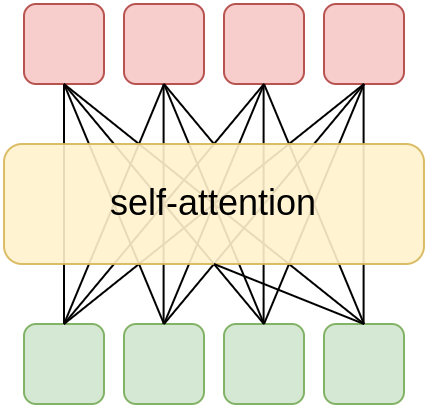
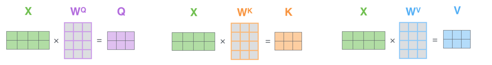
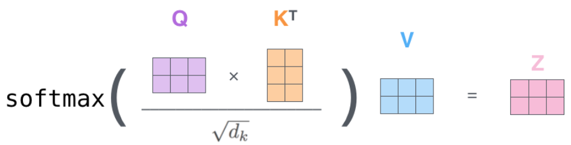
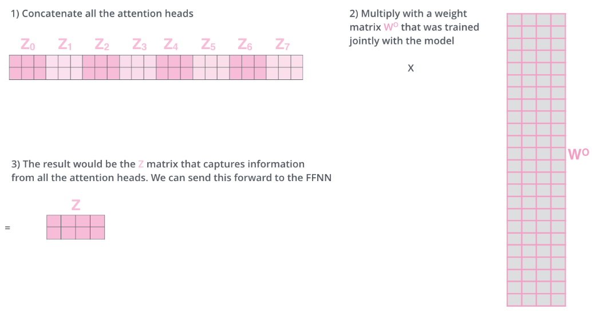
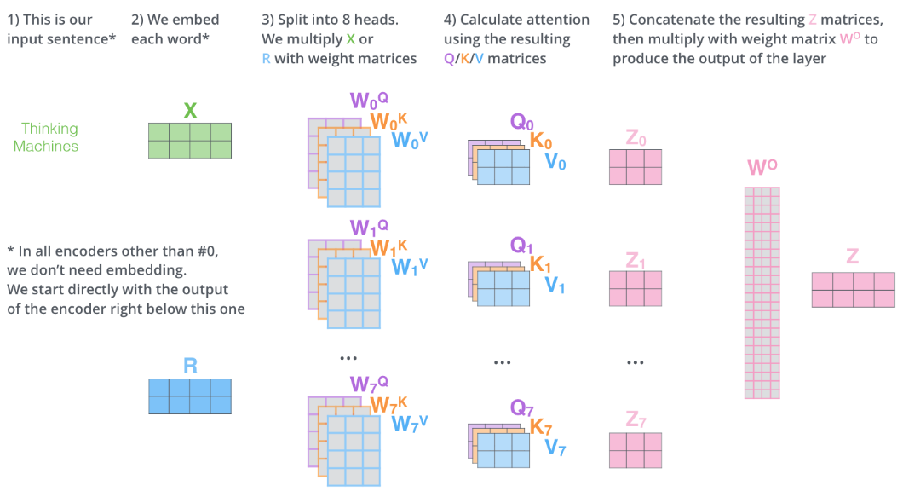

# Кодировщик трансформера

**Кодировщик** модели Transformer (transformer) [[1]](https://user.phil.hhu.de/~cwurm/wp-content/uploads/2020/01/7181-attention-is-all-you-need.pdf) принимает на вход $T$ эмбеддингов элементов входной последовательности и выдаёт $T$ <u>уточнённых эмбеддингов</u> для каждого элемента с учётом его контекста (других элементов последовательности).

> Например, в предложениях "*Замок запирается ключом*" и "*Замок окружён рвом, заполненным водой*" слово "*Замок*" имеет разные смыслы, что становится ясным из контекста.

Кодировщик состоит из $N$ последовательных применений **блоков кодировщика**, каждый раз - со своими параметрами. В оригинальной статье [[1]](https://user.phil.hhu.de/~cwurm/wp-content/uploads/2020/01/7181-attention-is-all-you-need.pdf) бралось $N=6$.

## Блок кодировщика

Схема одного блока кодировщика представлена ниже [[2]](https://medium.com/analytics-vidhya/attention-is-all-you-need-demystifying-the-transformer-revolution-in-nlp-68a2a5fbd95b) для перевода входного предложения "Thinking machines":

Первый блок кодировщика принимает $D$-мерные эмбеддинги каждого токена входной последовательности, прибавляет к ним эмбеддинги [позиции токена в последовательности](Positional-encoding) (чтобы сеть знала, где каждый токен расположен), после чего выдаёт такое же количество $D$-мерных выходных эмбеддингов, которые в результате некоторых преобразований уже <u>учитывают контекст всей входной последовательности</u> (всего переводимого предложения). В статье берётся $D=512$.

Поскольку в трансформере предлагается наслаивать такие блоки $N$ раз (каждый раз - со своими параметрами), каждый из блоков будет всё больше уточнять эмбеддинги по контексту, пока последний блок не выдаст итоговые эмбеддинги, с которыми впоследствии будет работать **декодировщик** модели, состоящий из отдельных [блоков декодировщика](Decoder).

:::tip Позиционное кодирование

Считается, что сети достаточно передать информацию о позициях токенов в последовательности лишь один раз в самом начале, поэтому позиционные эмбеддинги прибавляются к эмбеддингам входных токенов <u>только для первого блока декодировщика</u>. Последующие блоки работают только с выходными эмбеддингами предшествующих блоков <u>в неизменном виде</u>.

::: 

Каждый блок кодировщика имеет свои параметры, но функционально устроен единообразно:

1. каждый входной эмбеддинг преобразуется через **блок самовнимания** (self-attention) в выходной эмбеддинг;

2. входной и выходной эмбеддинги суммируются, как показано пунктиром на схеме;

3. суммарный эмбеддинг пропускается через [послойную нормализацию](../Training-simplification/LayerNorm) (LayerNorm);

4. результирующий эмбеддинг преобразуется [двухслойным персептроном](../MLP/Multilayer-perceptron) (Feed Forward) в выходной;

5. затем опять входной и выходной эмбеддинги (в контексте предыдущего шага) суммируются, как показано пунктиром на схеме;

6. суммарный эмбеддинг снова пропускается через послойную нормализацию (LayerNorm).

Для каждого из $N$ блоков декодировщика этапы 1-6 применяются к элементу входной последовательности (представленному эмбеддингом) <u>независимо с одинаковыми весами</u>. При этом веса внутри каждого блока свои. Рассмотрим подробнее каждый этап.

## Сумма входного и выходного эмбеддингов

Суммирование входа с выходом, как и в модели [ResNet](../Convolutional-architectures/ResNet), мотивировано тем, что

- градиент функции потерь по весам более ранних слоёв при обучении ведёт себя более стабильно — не взрывается и не затухает, что упрощает настройку этих слоёв и ускоряет обучение всей сети;

- в глубоких сетях целесообразно наслаивать слои, оставляя возможность модели сохранить текущее представление (что обеспечивает тождественная связь), а при необходимости — вносить лишь небольшие уточнения (с помощью нелинейного блока, веса которого инициализируются малыми числами).

## Feed Forward

**Feed Forward преобразование** представляет собой двухслойный [персептрон](../MLP/Multilayer-perceptron) с активацией [ReLU](../MLP/Activation-functions#rectified-linear-unit-relu):

$$
\mathbf{y}=\text{ReLU}\left(\mathbf{x}W_{1}+\mathbf{b}_{1}\right)W_{2}+\mathbf{b}_{2},
$$

где 

- $\mathbf{x}\in\mathbb{R}^{1\times D}$ - входной эмбеддинг токена,

- $\mathbf{y}\in\mathbb{R}^{1\times D}$ - его нелинейно преобразованная версия той же размерности,

- $W_1,W_2$ - обучаемые матрицы,

- $\mathbf{b}_1, \mathbf{b}_2$ - обучаемые вектора смещений.

Этот блок позволяет модели настраивать сложные зависимости и строить более богатые признаковые представления.

## Self-attention

**Блок самовнимания** (self-attention) призван обогатить эмбеддинг каждого токена информацией о других токенах последовательности. Каждый токен при этом использует информацию <u>со всех других токенов</u>, что схематично представляется в виде:

Рассмотрим детально, как работает блок самовнимания. Для большей ясности изложения будем писать сбоку внизу размерности векторов и матриц.

Пусть мы обрабатываем последовательность длины $T$ и каждый токен $\mathbf{x}_{1\times D}$ этой последовательности представляется $D$-мерным эмбеддингом. Тогда входную последовательность можно представить в виде матрицы $X_{T\times D}$.

Используется [механизм внимания](../Recurrent-neural-nets/Attention-RNN) (attention mechanism), в котором по эмбеддингу каждого токена генерируются: 

- $d$-мерный **запрос** (query) $\mathbf{q}_{1\times d}=\mathbf{x}_{1\times D}\cdot W_{D\times d}^{Q}$;

- $d$-мерный **ключ** (key) $\mathbf{k}_{1\times d}=\mathbf{x}_{1\times D}\cdot W_{D\times d}^{Q}$;

- $\bar{d}$-мерное **значение** (value) $\mathbf{v}_{1\times \bar{d}}=\mathbf{x}_{1\times D}\cdot W_{D\times\bar{d}}^{V}$. 

> В статье [[1]](https://user.phil.hhu.de/~cwurm/wp-content/uploads/2020/01/7181-attention-is-all-you-need.pdf) использовались $\bar{d}=d=D/8$, поскольку самовнимание впоследствии повторялось 8 раз.

Объединяя для каждого токена последовательности вектора их запросов, ключей и значений, получим: 

- матрицу запросов $Q_{T\times d}$;

- матрицу ключей $K_{T\times d}$;

- матрицу значений $V_{T\times \bar{d}}$.

Тогда выходной эмбеддинг вычисляется агрегацией <u>значений</u> для всех токенов последовательности:

$$
\mathbf{y}_{1\times\bar{d}}=\text{softmax}\left(\frac{1}{\sqrt{d}}\mathbf{q}_{1\times d}\left(K^{T}\right)_{d\times T}\right)_{1\times T}V_{T\times\bar{d}}
$$

Агрегация производится суммированием <u>значений</u> с весами, равными соответствиям соответствующих <u>ключей</u> <u>запросу</u>. Соответствия вычисляются по их отмасштабированному скалярному произведению ([scaled dot-product attention](../Recurrent-neural-nets/Attention-RNN#вычисление-соответствий)).

## Матричная запись

Для повышения производительности вычисления производятся <u>для всех токенов одновременно</u>, используя матричную запись.

Генерируются матрицы:

– запросов: $Q_{T\times d}=X_{T\times D}W_{D\times d}^{Q}$;

– ключей: $K_{T\times d}=X_{T\times D}W_{D\times d}^{K}$;

– значений: $V_{T\times\bar{d}}=X_{T\times D}W_{D\times\bar{d}}^{V}$.

Вычисления над полученными матрицами графически проиллюстрированы ниже [[2]](https://medium.com/analytics-vidhya/attention-is-all-you-need-demystifying-the-transformer-revolution-in-nlp-68a2a5fbd95b):

Результат самовнимания <u>для всех токенов</u> запишется как

$$
Y_{T\times\bar{d}}=\text{softmax}\left(\frac{1}{\sqrt{d}}Q_{T\times d}\left(K^{T}\right)_{d\times T}\right)_{T\times T}V_{T\times\bar{d}},
$$

что можно изобразить графически [[2]](https://medium.com/analytics-vidhya/attention-is-all-you-need-demystifying-the-transformer-revolution-in-nlp-68a2a5fbd95b):

Объединяя все операции, одна **головка самовнимания** (self-attention head)  работает следующим образом: 

$$
\begin{gathered}\text{head}\left(X|W^{K},W^{V},W^{Q}\right)_{T\times\bar{d}}\\
=\text{softmax}\left(\frac{1}{\sqrt{d}}Q_{T\times d}\left(K^{T}\right)_{d\times T}\right)_{T\times T}V_{T\times\bar{d}}\\
=\text{softmax}\left(\frac{1}{\sqrt{d}}\left(\underset{Q}{\underbrace{XW^{Q}}}\right)\left(\underset{K}{\underbrace{XW^{K}}}\right)^{T}\right)\underset{V}{\underbrace{XW^{V}}}
\end{gathered}
$$

## Multi-head self-attention

В трансформере [[1]](https://user.phil.hhu.de/~cwurm/wp-content/uploads/2020/01/7181-attention-is-all-you-need.pdf) используется не одна, а 8 головок самовнимания, каждая - со своими весами $W^{Q},W^{K},W^{V}$. Каждая головка призвана собирать <u>свою контекстную информацию</u>, что и наблюдается на практике. 

После применения головок самовнимания их результаты конкатенируются, после чего пропускаются через линейное преобразование c матрицей $W_{8\bar{d}\times D}^{O}$, чтобы вернуть размерность эмбеддинга к исходному $D$-мерному вектору:

$$
Z=\text{concat}_{T\times8\bar{d}}\left[\text{head}\left(X|W_{n}^{K},W_{n}^{V},W_{n}^{Q}\right)\right]_{n=1}^{8}W_{8\bar{d}\times D}^{O}
$$

Графически это выглядит следующим образом [[2]](https://medium.com/analytics-vidhya/attention-is-all-you-need-demystifying-the-transformer-revolution-in-nlp-68a2a5fbd95b):

Весь процесс совместно можно визуализировать как [[2]](https://medium.com/analytics-vidhya/attention-is-all-you-need-demystifying-the-transformer-revolution-in-nlp-68a2a5fbd95b):

## Сравнение с рекуррентной сетью

Сравним головку самовнимания трансформера с рекуррентной сетью. Пусть для простоты обрабатываются $D$-мерные эмбеддинги, размерность скрытого состояния рекуррентной сети совпадает с размерностями эмбеддингов самовнимания и тоже равна $D$.

Для суммаризации информации о $D$-мерных эмбеддингах последовательности длины $T$ [рекуррентной сети](../Recurrent-neural-nets/RNN) требуется $O(T D^{2})$ операций, в то время как модулю самовнимания - $O(T D^2 + T^{2} D)$ (обоснуйте!). Таким образом, сложность вычислений трансформера <u>сильнее зависит от длины обрабатываемой последовательности</u>.

Для сбора информации для эмбеддинга с другого эмбеддинга рекуррентной сети требуется порядка $O(T)$ проходов по последовательности (а с каждой итерацией часть информации теряется!), в то время как самовнимание считывает эту информацию напрямую за $O(1)$, поэтому <u>информация передаётся с меньшими искажениями</u>.

Рекуррентная сеть хранит историю целиком в одном $D$-мерном внутреннем состоянии, а трансформеру требуется хранить все $T$ $D$-мерных эмбеддингов, в связи с чем трансформеру для работы требуется <u>значительно больше памяти</u>.

## Итог

Подытоживая, блок кодировщика уточняет начальные эмбеддинги каждого токена входной последовательности, пропуская их через нелинейные преобразования Feed Forward и агрегируя информацию с эмбеддингов других токенов последовательности, используя self-attention. Для удобства настройки блоки самовнимания и Feed Forward реализуются как [остаточные блоки](../Training-simplification/ResBlock).

Всего в трансформере [[1]](https://user.phil.hhu.de/~cwurm/wp-content/uploads/2020/01/7181-attention-is-all-you-need.pdf) использовано 6 таких блоков, работающих последовательно.

Первый блок кодировщика обрабатывает эмбеддинги входных токенов в сумме с эмбеддингами, кодирующими расположение этих токенов в последовательности ([позиционное кодирование](Positional-encoding)). Последующие блоки кодировщика обрабатывают выходные эмбеддинги предыдущего блока в неизменном виде.

В следующей главе мы рассмотрим, как устроено [позиционное кодирование](Positional-encoding).

## Литература

1. [Vaswani A. Attention is all you need //Advances in Neural Information Processing Systems. – 2017.](https://user.phil.hhu.de/~cwurm/wp-content/uploads/2020/01/7181-attention-is-all-you-need.pdf)
2. [medium.com: Attention is All You Need: Demystifying the Transformer Revolution in NLP.](https://medium.com/analytics-vidhya/attention-is-all-you-need-demystifying-the-transformer-revolution-in-nlp-68a2a5fbd95b)
