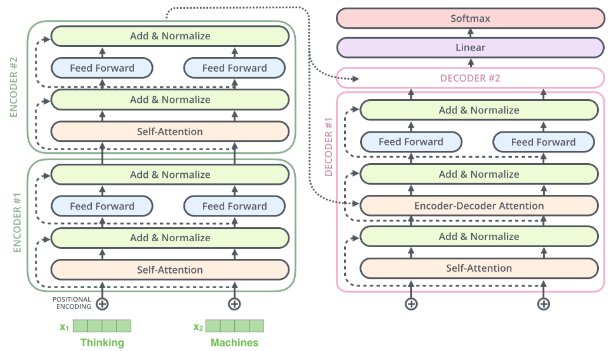
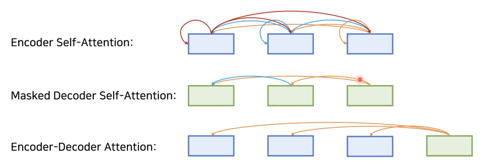

# Декодировщик трансформера

**Декодировщик** модели [трансформера](Transformer) (transformer) [[1]](https://user.phil.hhu.de/~cwurm/wp-content/uploads/2020/01/7181-attention-is-all-you-need.pdf) принимает на вход $M$ эмбеддингов элементов <u>уже сгенерированной последовательности</u> и выдаёт вероятностное распределение следующего предсказываемого элемента последовательности.

Будем, как и в оригинальной статье [[1]](https://user.phil.hhu.de/~cwurm/wp-content/uploads/2020/01/7181-attention-is-all-you-need.pdf), рассматривать задачу машинного перевода текста с одного языка на другой, в которой:

- входная последовательность - текст на исходном языке;

- выходная последовательность - текст на целевом языке.

Каждая последовательность состоит из токенов, которыми выступают слова текста.

Декодировщик состоит из $N$ последовательных применений **блоков декодировщика**, каждый раз - со своими параметрами. В оригинальной статье [[1]](https://user.phil.hhu.de/~cwurm/wp-content/uploads/2020/01/7181-attention-is-all-you-need.pdf) бралось $N=6$.

> Задача каждого блока - уточнить эмбеддинги сгенерированных токенов с учётом их контекста из других сгенерированных токенов.

Последний блок выдаёт окончательные эмбеддинги, к каждому из которых независимо применяется линейный слой (с одинаковыми параметрами) и [SoftMax-преобразование](../MLP/Outputs-loss-functions#softmax-преобразование). Итоговый вектор выходов интерпретируется как вероятность токенов на каждой позиции выходной последовательности. Нас интересует только токен на позиции $t$, который выбирается максимально вероятным. После этого декодировщик перезапускается для предсказания токенов в позициях $t+1,t+2,...$ пока не будет сгенерирован токен [EOS] (end of sequence), означающий конец генерации.

## Блок декодировщика

Схема **блока декодировщика** в модели [трансформера](Transformer) [[1]](https://user.phil.hhu.de/~cwurm/wp-content/uploads/2020/01/7181-attention-is-all-you-need.pdf) показана на рисунке справа внизу [[2]](https://medium.com/analytics-vidhya/attention-is-all-you-need-demystifying-the-transformer-revolution-in-nlp-68a2a5fbd95b):

Блок декодировщика показан в контексте двух блоков кодировщика и ещё одного блока декодировщика и последующих преобразований (в оригинальной работе использовалось 6 блоков).

Как видим, блок декодировщика состоит из [тех же преобразований](Encoder-self-attention), что и блок кодировщика. Преобразования применяются к каждому токену <u>независимо</u>. 

## Отличия декодировщика от кодировщика

Для декодировщика входными токенами является уже не входная, а выходная последовательность, сдвинутая на один шаг вперёд спец. токеном [BOS] (beginning of sequence), как [описывалось ранее](Transformer#декодировщик). 

> Это сделано для того, чтобы каждый раз для всех ранее сгенерированных токенов предсказывался следующий, а в самом начале - первый токен.

Крупным пунктиром на схеме выше обозначена тождественная связь, когда входной эмбеддинг в неизменном виде прибавляется к выходному.

### Блок самовнимания

**Блок самовнимания** (self-attention) в декодировщике применяется точно так же, как и в [случае кодировщика](Encoder-self-attention#self-attention), с тем лишь отличием, что <u>степени внимания маскируются</u> таким образом, чтобы из позиции $t$ нельзя было смотреть в будущие позиции $t+1,t+2,...$, которые ещё не сгенерированы (masked attention). Реализуется это прибавлением $-\infty$ к скалярным произведениям запроса $\mathbf{q}$ и каждого ключа $\mathbf{k}$  в запрещённых (будущих) позициях, что после применения [SoftMax-преобразования](../MLP/Outputs-loss-functions#softmax-преобразование), делает степень внимания к этим позициям нулевой, препятствуя заглядыванию декодировщика в будущие элементы последовательности, которые ещё не сгенерированы.

### Блок кросс-внимания

Также в декодировщике используется **блок кросс-внимания** (cross-attention, encoder-decoder attention), уточняющий эмбеддинги декодировщика, <u>опираясь на информацию о входной последовательности</u>. Ведь чтобы осуществить перевод на другой язык, необходимо прочитать текст на исходном языке! Он устроен точно так же, как и [блок самовнимания в кодировщике](Encoder-self-attention#self-attention), но внимание в нём направлено от токенов <u>выходной</u> последовательности к итоговым токенам <u>входной</u> последовательности, полученных с <u>выходов последнего блока кодировщика</u>. Это реализуется тем, что:

- **запросы** (queries) генерируются по уже сгенерированным токенам <u>выходной</u> последовательности;
- **ключи** (keys) и **значения** (values) генерируются по эмбеддингам <u>входной</u> последовательности.

Этот вид внимания визуализирован на схеме выше линиями с мелким пунктиром.

## Виды внимания в трансформере

Таким образом, в модели трансформера использовались три типа внимания:

- <u>самовнимание в кодировщике</u>, когда входной токен мог смотреть на любой другой входной токен;

- <u>маскированное внимание в декодировщике</u>, когда текущий выходной токен мог смотреть только на себя и на предыдущие;

- <u>кросс-внимание в декодировщике</u>, когда выходной токен мог смотреть на любые входные токены.

Эти типы внимания проиллюстрированы ниже [[3]](https://velog.io/@kimjunsu97/MetaCodeDeep-Learning-NLP-Attention-Transformer):

## Литература

1. [Vaswani A. Attention is all you need //Advances in Neural Information Processing Systems. – 2017.](https://user.phil.hhu.de/~cwurm/wp-content/uploads/2020/01/7181-attention-is-all-you-need.pdf)
2. [medium.com: Attention is All You Need: Demystifying the Transformer Revolution in NLP.](https://medium.com/analytics-vidhya/attention-is-all-you-need-demystifying-the-transformer-revolution-in-nlp-68a2a5fbd95b) 
3. [velog.io: MetaCode(Deep Learning) - NLP (Attention & Transformer).](https://velog.io/@kimjunsu97/MetaCodeDeep-Learning-NLP-Attention-Transformer)

