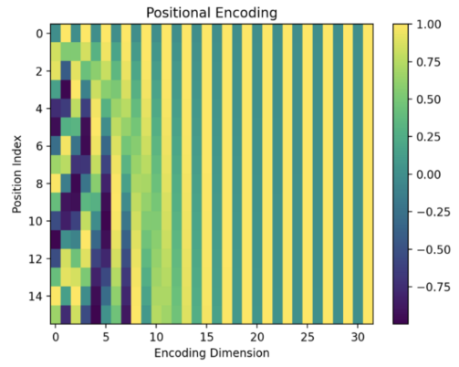

# Позиционное кодирование

Все этапы в [блоке кодировщика](Encoder-self-attention) модели [трансформера](Transformer) [[1]](https://user.phil.hhu.de/~cwurm/wp-content/uploads/2020/01/7181-attention-is-all-you-need.pdf) (feed forward, суммирование, нормализация, самовнимание) работают <u>независимо для каждого токена</u>. Это ускоряет работу модели, позволяя производить вычисления параллельно, однако при этом <u>полностью теряется информация о позиции</u> каждого токена последовательности.

> Но эта информация важна. Например, фразы "*the mother loves the daughter*" и "*the daughter loves the mother*" состоят из одних и тех же слов, но имеют  разный смысл!

Для интеграции информации о позиции каждого токена используется **позиционное кодирование** (positional encoding), состоящее в том, что каждой <u>позиции</u> pos (индекса токена в последовательности) сопоставляется свой $D$-мерный эмбеддинг, а затем эти эмбеддинги прибавляются к эмбеддингам самих токенов.

:::tip Использование в архитектуре

Позиционные эмбеддинги прибавляются только ко входам <u>первого блока кодировщика</u>. Последующие блоки кодировщика работают с выходными эмбеддингами предыдущего блока в неизменном виде.

В блоках [декодировщика](Decoder) позиционное кодирование также <u>используется только для входов самого первого блока</u>.

:::

Вектор позиционного кодирования $\mathbf{e}^p\in\mathbb{R}^D$ для токена на позиции $p=1,2,...T$ заполняется синусами от этой позиции на чётных элементах вектора и косинусами от позиции - на нечётных, причем для разных элементов используются синусы и косинусы разных периодов от $2\pi$ до $10000\cdot 2\pi$:

$$
\begin{aligned}
\mathbf{e}^p_{2i} & = \sin\left(pos/10000^{2i/D}\right)\\
\mathbf{e}^p_{2i+1} & = \cos\left(pos/10000^{2i/D}\right) 
\end{aligned}

$$

Можно объединить эти вектора в матрицу $E\in \mathbb{R}^{T\times D}$. 

Пример визуализации этой матрицы при кодировании последовательности из 32 токенов в 16-мерном пространстве приведён ниже [[2]](https://naokishibuya.medium.com/positional-encoding-286800cce437):

$j$-му токену будет соответствовать $j$-й столбец. Как видим, существует взаимно однозначное соответствие между номером позиции и её эмбеддингом.

:::tip Интуиция

Позиционное кодирование идейно повторяет кодирование номеров позиций в виде двоичного представления:

$$
0\to\left(0,0,0,\cdots\right)\\1\to\left(1,0,0,\cdots\right)\\2\to\left(0,1,0,\cdots\right)\\3\to\left(1,1,0,\cdots\right)\\4\to\left(0,0,1,\cdots\right)\\5\to\left(1,0,1,\cdots\right)\\6\to\left(0,1,1,\cdots\right)\\7\to\left(1,1,1,\cdots\right) \\ \cdots
$$

В этом представлении более поздние биты представления меняются более плавно, чем более ранние. Такой же эффект реализуется и в формулах позиционного кодирования, что позволяет нейросети восстановить позицию по эмбеддингу этой позиции.

:::

## Литература

1. [Vaswani A. Attention is all you need //Advances in Neural Information Processing Systems. – 2017.](https://user.phil.hhu.de/~cwurm/wp-content/uploads/2020/01/7181-attention-is-all-you-need.pdf)
2. [naokishibuya.medium.com: Transformer’s Positional Encoding.](https://naokishibuya.medium.com/positional-encoding-286800cce437)
